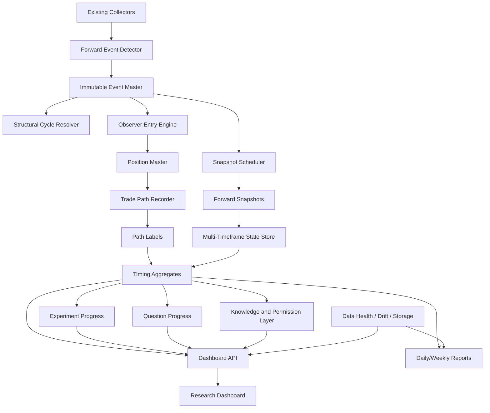

# AMI Forward Intelligence Observatory, Timing Intelligence & Comprehensive Research Dashboard

## Canonical Complete Implementation Specification v1.0

```text
Document class: SOFTWARE + DATA + RESEARCH GOVERNANCE SPECIFICATION
Status: IMPLEMENTATION READY
Execution mode: ORDERLESS / RESEARCH_ONLY / FORWARD_OBSERVATION
Operational permission: FORBIDDEN
Primary objective: Forward evidence accumulation without changing live or shadow trade behavior
```

---

# 0. Document Control

## 0.1 Canonical name

```text
AMI_FORWARD_INTELLIGENCE_OBSERVATORY_TIMING_DASHBOARD_v1.0_COMPLETE
```

## 0.2 Scope

This document defines the full backend, database, scheduler, observer, API, dashboard, reporting, data-health, governance, testing, migration and rollback requirements for a continuously running AMI forward research observatory.

It combines:

- forward event tracking;
- full event-cycle reconstruction;
- LONG and SHORT opportunity observation;
- entry timing research;
- trade-path recording;
- hold/failure/exit timing analysis;
- silence intelligence;
- management and re-entry observers;
- active experiment tracking;
- Question Registry progress;
- Knowledge Graph and permission visibility;
- data-health, drift and storage monitoring;
- daily and weekly research reporting.

## 0.3 Existing experiments and verdicts are immutable

Do not alter, reinterpret, overwrite or silently relabel existing closed experiments or their verdicts:

```text
E-BUYFADE-STRUCT-001
E-BUYFADE-REENTRY-001
E-BUYFADE-SILEXIT-001
E-HOUR17-FWD-001
E-CONVCOMP-FWD-001
existing latent/regime/risk experiments
```

Historical findings may be linked as context, but the new observatory must not modify their original:

- preregistration;
- candidate definition;
- binding;
- data split;
- result;
- verdict;
- permission ceiling.

## 0.4 Non-goals

This package must not:

```text
open an order
close an order
modify an order
change a route
change a stop
change a take-profit
change leverage
change sizing
change risk limits
promote an alpha
enable LIVE_ALLOWED
enable SIZING_ALLOWED
enable PORTFOLIO_ALLOWED
start a new experiment without operator approval
move the project to Phase 6B
delete raw data automatically
```

---

# 1. Executive Objective

AMI must become a continuously operating **forward intelligence observatory**, not merely a list of closed shadow trades.

For each important market event, the system must capture the complete structural path:

```text
pre-event LONG genesis
→ LONG expansion
→ LONG maturity
→ LONG exhaustion candidate
→ early SHORT possibility
→ T0 event
→ near-delayed SHORT possibilities
→ late continuation SHORT possibilities
→ SHORT management
→ SHORT exit
→ SHORT re-entry
→ SHORT stall
→ SHORT→LONG transition
→ LONG entry
→ LONG management
→ LONG exit
→ LONG re-entry
→ LONG→SHORT transition
```

The system must answer, with forward-safe evidence:

```text
What happened before the event?
When did the move become knowable?
Which entry timing was executable?
How much adverse movement came first?
When did winners usually begin working?
When did losers become distinguishable?
How long did the edge remain alive?
Which exit retained the most MFE?
Which management rule avoided losses?
Which re-entry created edge and which created churn?
Was the stronger opportunity before the event LONG or after the event SHORT?
How many independent structural cycles support the conclusion?
Which regimes and sessions remain unobserved?
Is the dataset descriptive-ready, research-ready or still insufficient?
```

---

# 2. Immutable Safety Boundary

## 2.1 Untouched components

The implementation must not modify:

```text
live executor
live order logic
risk engine
leverage
position sizing
portfolio brain
.env
existing live permissions
existing route behavior
existing shadow order behavior
existing closed experiment bindings
```

## 2.2 Allowed output classes

All new observers and analytics must be one of:

```text
ORDERLESS
RESEARCH_ONLY
FORWARD_OBSERVATION
OBSERVATION_ONLY
NO_ORDER_EFFECT
```

## 2.3 Forbidden output classes

No new component may emit:

```text
LIVE_ALLOWED
SIZING_ALLOWED
PORTFOLIO_ALLOWED
AUTOMATIC_ROUTE_CHANGE
AUTOMATIC_PROMOTION
AUTOMATIC_PREREGISTRATION
AUTOMATIC_EXPERIMENT_START
```

## 2.4 Required provenance

Every observer, feature set, labeler and aggregate must carry:

```yaml
observer_version:
feature_version:
label_version:
schema_version:
activation_timestamp:
code_commit:
source_hash:
provenance:
created_at:
updated_at:
```

## 2.5 Forward evidence rule

Events before an observer's activation timestamp may be used only as:

```text
HISTORICAL_REPLAY
```

They must never increase:

```text
FORWARD_EVIDENCE_N
INDEPENDENT_FORWARD_CYCLE_N
FORWARD_EXPERIMENT_PROGRESS
PREDICTION_READINESS_N
```

---

# 3. Evidence and Record Taxonomy

Every position, observer and metric must be separated by record type.

```text
ACTUAL_SHADOW
OBSERVER_HYPOTHETICAL
HISTORICAL_REPLAY
```

They must never be merged into one N, one PnL curve or one verdict.

## 3.1 Evidence levels

```text
RAW_OBSERVATION
DESCRIPTIVE_FORWARD
REPLICATED_FORWARD
PREREGISTERED_FORWARD
CALIBRATED_FORWARD
OPERATOR_REVIEWED
```

## 3.2 Readiness levels

```text
NOT_READY
DATA_COLLECTION_ONLY
DESCRIPTIVE_READY
MODEL_RESEARCH_READY
FORWARD_CALIBRATION_REQUIRED
RESEARCH_READY
```

## 3.3 Permission ceilings

```text
VIEW_ONLY
RESEARCH_ONLY
PREREG_ALLOWED
SHADOW_ALLOWED
LIVE_FORBIDDEN
```

This package may never raise the ceiling above `RESEARCH_ONLY`.

---

# 4. System Architecture

## 4.1 High-level flow



## 4.2 Runtime principles

- The trading collector remains the source of truth.
- The observatory consumes data asynchronously.
- No dashboard query may block a collector.
- No observer may call order APIs.
- All writes must be idempotent.
- All long-running jobs must be restart-safe.
- All feature use must pass a known-at timestamp contract.
- Raw events and derived observations must remain separable.
- Aggregates must be rebuildable from canonical records.

---

# 5. Core Identity Model

The system must distinguish:

```text
market event
structural cycle
position
lane
observer
experiment
question
knowledge object
```

## 5.1 Event identity

An event is one concrete market trigger.

```yaml
event_id:
event_family:
symbol:
venue:
event_ts:
event_side:
event_notional:
route_version:
collector_version:
schema_version:
code_commit:
```

## 5.2 Structural cycle identity

Multiple events or lanes may belong to one underlying market movement.

```yaml
structural_cycle_id:
parent_event_id:
previous_related_event_id:
event_sequence_number:
cycle_start_ts:
cycle_end_ts:
cycle_resolution_status:
cycle_resolution_version:
```

## 5.3 Why structural cycle N is mandatory

If three LONG lanes open from the same ETH movement:

```text
raw position N = 3
independent structural cycle N = 1
```

Dashboard and reports must show both values.

No statistical result may display WR, mean, median or probability without also displaying:

```text
raw N
independent cycle N
distinct event days
regime coverage
pending N
```

## 5.4 Suggested cycle resolver

The first implementation may use a deterministic resolver based on:

```text
same symbol
same event family
time distance threshold
cascade continuity
shared parent event
overlapping observer horizon
same dominant structural state
```

The resolver must be versioned and must not silently change previous cycle IDs.

---

# 6. Time and Lookahead Contract

## 6.1 Required timestamps

Every feature or state used by an observer must carry:

```text
event_ts
available_at_ts
known_at_ts
```

Definitions:

```text
event_ts:
The market time at which the underlying fact occurred.

available_at_ts:
The time at which the raw source became available to the system.

known_at_ts:
The earliest time at which the computed feature could validly be used.
```

## 6.2 Mandatory rule

```text
known_at_ts <= observer_trigger_ts
```

If false:

```text
REJECT_REASON = FUTURE_INFORMATION
```

## 6.3 Partial candles

Unfinished daily and weekly candles must be tagged:

```text
PARTIAL_CANDLE
```

They must never be stored or displayed as a closed-candle state.

## 6.4 Missing data

Missing data must never be converted to zero.

Allowed states:

```text
AVAILABLE
MISSING
STALE
GAPPED
NOT_COLLECTED
NOT_APPLICABLE
```

## 6.5 Timezone

Canonical storage:

```text
UTC
```

Dashboard may display local time, but every UI element must expose UTC in tooltip or detail view.

---

# 7. Forward Event Master Record

Create one immutable event row per eligible event.

## 7.1 Required fields

```yaml
event_id:
event_family:
symbol:
venue:
event_ts:
event_notional:
event_side:
route_version:
collector_version:
schema_version:
code_commit:

structural_cycle_id:
parent_event_id:
previous_related_event_id:
event_sequence_number:

data_health_at_event:
feature_coverage:
missing_features:
source_latency:
duplicate_status:

session:
hour_utc:
day_of_week:
market_regime:
volatility_regime:
btc_state:
timeframe_alignment:

record_type:
activation_status:
source_hash:
created_at:
```

## 7.2 Suggested SQL

```sql
CREATE TABLE IF NOT EXISTS ami_forward_events (
    event_id TEXT PRIMARY KEY,
    event_family TEXT NOT NULL,
    symbol TEXT NOT NULL,
    venue TEXT NOT NULL,
    event_ts TEXT NOT NULL,
    event_notional REAL,
    event_side TEXT,
    route_version TEXT,
    collector_version TEXT NOT NULL,
    schema_version TEXT NOT NULL,
    code_commit TEXT NOT NULL,

    structural_cycle_id TEXT NOT NULL,
    parent_event_id TEXT,
    previous_related_event_id TEXT,
    event_sequence_number INTEGER,

    data_health_at_event TEXT,
    feature_coverage REAL,
    missing_features_json TEXT,
    source_latency_ms INTEGER,
    duplicate_status TEXT,

    session TEXT,
    hour_utc INTEGER,
    day_of_week INTEGER,
    market_regime TEXT,
    volatility_regime TEXT,
    btc_state TEXT,
    timeframe_alignment TEXT,

    record_type TEXT NOT NULL,
    activation_status TEXT NOT NULL,
    source_hash TEXT NOT NULL,
    created_at TEXT NOT NULL,

    CHECK(record_type IN (
        'ACTUAL_SHADOW',
        'OBSERVER_HYPOTHETICAL',
        'HISTORICAL_REPLAY'
    ))
);
```

---

# 8. Forward Snapshot Scheduler

## 8.1 Pre-event snapshots

```text
T−7D
T−3D
T−2D
T−1D
T−12h
T−8h
T−6h
T−4h
T−3h
T−2h
T−1h
T−30m
T−15m
T−10m
T−5m
T−3m
T−1m
T−30s
```

## 8.2 Post-event snapshots

```text
T+30s
T+1m
T+2m
T+3m
T+5m
T+10m
T+15m
T+20m
T+30m
T+45m
T+60m
T+75m
T+90m
T+2h
T+3h
T+4h
T+6h
T+8h
T+12h
T+24h
T+2D
T+3D
T+7D
```

## 8.3 Snapshot states

```text
PENDING
COMPLETED
MISSING
STALE
GAPPED
NOT_COLLECTED
NOT_APPLICABLE
FAILED_RETRYABLE
FAILED_FINAL
```

## 8.4 Idempotency key

```text
(event_id, horizon_key, snapshot_version)
```

A late T+7D completion must update the existing logical snapshot, not create a duplicate.

## 8.5 Scheduler behavior

- Future horizons remain `PENDING`.
- Overdue horizons create incidents.
- Retryable missing data is retried with bounded backoff.
- A restart resumes from pending/overdue horizons.
- No scheduler job may infer unavailable historical states.
- Historical replay snapshots must be explicitly marked.

---

# 9. Multi-Timeframe State Store

For each snapshot, store states from:

```text
1m
5m
15m
1h
4h
1D
1W
```

## 9.1 Per-timeframe fields

```yaml
state_label:
direction:
confidence:
state_age_seconds:
trend_slope:
volatility:
structure_phase:
data_quality:
candle_status:
available_at_ts:
known_at_ts:
state_engine_version:
```

## 9.2 State labels

The exact existing state engine labels remain canonical. Dashboard must additionally normalize direction into:

```text
UP
DOWN
RANGE
WEAKENING
STRENGTHENING
UNKNOWN
```

## 9.3 Example UI

```text
1m   DOWN         confidence 0.81
5m   DOWN         confidence 0.74
15m  RANGE        confidence 0.56
1h   WEAKENING    confidence 0.63
4h   UP           confidence 0.77
1D   UP           PARTIAL_CANDLE
1W   UNKNOWN      MISSING
```

---

# 10. Pre-Event LONG Intelligence

A BUY-fade event must not be interpreted only as the beginning of a SHORT.

The system must also observe the possible LONG path before the event.

## 10.1 Required fields

```yaml
estimated_long_start_candidates:
long_start_anchor_types:
long_age_at_event:
return_since_candidate_start:
long_slope:
long_acceleration:
long_deceleration:
higher_high_count:
higher_low_count:
distance_from_1h_high:
distance_from_4h_high:
distance_from_1d_high:
distance_from_1w_high:
compression_breakout_status:
reclaim_status:
btc_sync_during_long:
flow_support:
oi_support_if_available:
funding_state:
long_maturity_state:
long_exhaustion_state:
known_at_ts:
```

## 10.2 Neutral maturity labels

```text
NEW_LONG
EXPANDING_LONG
MATURE_LONG
DECELERATING_LONG
EXHAUSTED_LONG
COUNTERTREND_BOUNCE
RANGE_UNKNOWN
```

These are descriptive states, not alpha claims.

## 10.3 Core questions

```text
When could the LONG have started?
How many hours or days old was the LONG at T0?
Was T0 near the beginning, middle or mature portion of the LONG?
Was the LONG decelerating before T0?
Would a pre-event LONG have produced stronger executable expectancy?
Was T0 a potential LONG exit point?
```

---

# 11. Observer Entry Engine

Every observer must be hypothetical and orderless.

## 11.1 Record separation

```text
ACTUAL_SHADOW
OBSERVER_HYPOTHETICAL
HISTORICAL_REPLAY
```

## 11.2 Early SHORT observers

Candidate horizons:

```text
T−4h
T−2h
T−1h
T−30m
T−15m
T−10m
T−5m
T−3m
T−1m
```

The system must not choose timestamps because it knows a future event will occur.

A valid early-entry research lane must also create matched non-event timestamps so it can measure:

```text
false early signal
event never arrived
stop before event
time exposed before event
pre-event MAE
post-event MFE
```

## 11.3 T0 SHORT baseline

Canonical reference baseline:

```text
entry: T0 executable fill
hold: 45m
SL: 75 bps
fee: 5 bps
```

Existing route behavior remains unchanged. This is an observational reference.

## 11.4 Near-delayed SHORT observers

```text
T+30s
T+1m
T+2m
T+3m
T+5m
T+10m
T+15m
T+30m
```

## 11.5 Late continuation SHORT observers

```text
T+45m
T+60m
T+75m
T+90m
T+2h
T+3h
T+4h
T+6h
```

These must be classified as:

```text
POST_EVENT_CONTINUATION_ROUTE
```

not as a small T0 delay.

## 11.6 Confirmation observers

When coverage exists:

```text
event high rejection
1m lower-high
5m lower-high
failed reclaim
local-low break
OFI negative flip
CVD negative transition
BUY aggression decay
BTC weakness
silence onset
```

Every trigger requires:

```yaml
trigger_ts:
feature_available_at_ts:
feature_known_at_ts:
fill_ts:
fill_price:
trigger_version:
source_hash:
```

## 11.7 Parallel LONG observers

```text
compression breakout LONG
1h reclaim LONG
4h higher-low LONG
daily reclaim LONG
seller-exhaustion recovery LONG
BTC-recovery-led LONG
flow-confirmed LONG
```

Required output:

```yaml
long_observer_id:
candidate_entry_ts:
entry_reason:
entry_price:
entry_timeframe:
MFE_to_event:
MAE_to_event:
PnL_at_event:
PnL_at_T30:
PnL_at_T45:
PnL_at_T1h:
PnL_at_T4h:
PnL_at_T1D:
```

---

# 12. Forward Position Master

Every actual shadow and hypothetical observer position gets one canonical position row.

## 12.1 Suggested SQL

```sql
CREATE TABLE IF NOT EXISTS ami_forward_position_master (
    position_id TEXT PRIMARY KEY,
    event_id TEXT NOT NULL,
    structural_cycle_id TEXT NOT NULL,
    lane_id TEXT NOT NULL,
    rule_id TEXT NOT NULL,
    direction TEXT NOT NULL,
    record_type TEXT NOT NULL,

    signal_ts TEXT NOT NULL,
    trigger_ts TEXT,
    entry_ts TEXT,
    entry_price REAL,
    executable_entry_price REAL,

    baseline_exit_ts TEXT,
    close_ts TEXT,
    close_price REAL,
    executable_close_price REAL,
    close_reason TEXT,

    status TEXT NOT NULL,
    observer_version TEXT NOT NULL,
    feature_version TEXT NOT NULL,
    schema_version TEXT NOT NULL,
    activation_timestamp TEXT NOT NULL,
    code_commit TEXT NOT NULL,
    source_hash TEXT NOT NULL,

    created_at TEXT NOT NULL,
    updated_at TEXT NOT NULL,

    CHECK(direction IN ('LONG', 'SHORT')),
    CHECK(record_type IN (
        'ACTUAL_SHADOW',
        'OBSERVER_HYPOTHETICAL',
        'HISTORICAL_REPLAY'
    )),
    CHECK(status IN (
        'PENDING_ENTRY',
        'OPEN',
        'CLOSED',
        'CANCELLED',
        'INVALID',
        'OUTCOME_PENDING'
    ))
);
```

## 12.2 Position registration rules

- One logical observer entry creates one position ID.
- Restart must not duplicate a position.
- Actual shadow positions must preserve their original shadow trade ID as provenance.
- Observer positions cannot write into the shadow order table.
- Historical replay positions cannot increase forward N.
- Same-cycle position count and independent-cycle contribution must be computable.

---

# 13. Event-Time Trade Path Ledger

This is the central timing intelligence layer.

The system must not save only entry, exit and final PnL. It must record the path.

## 13.1 Canonical path flow

```text
signal created
→ trigger known
→ executable entry
→ first adverse move
→ first favorable move
→ first positive
→ first breakeven after drawdown
→ MFE evolution
→ MAE evolution
→ state transitions
→ baseline horizon
→ actual close
→ post-close diagnostic horizons
```

## 13.2 Live open-position sampling

While a position is open:

```text
sample every 30 seconds
```

This high-frequency path may use HOT retention.

Permanent canonical horizons:

```text
T+30s
T+1m
T+2m
T+3m
T+5m
T+10m
T+15m
T+20m
T+30m
T+45m
T+60m
T+75m
T+90m
T+2h
T+3h
T+4h
T+6h
T+8h
T+12h
T+24h
```

## 13.3 Suggested SQL

```sql
CREATE TABLE IF NOT EXISTS ami_forward_position_path (
    position_id TEXT NOT NULL,
    asof_ts TEXT NOT NULL,
    elapsed_seconds INTEGER NOT NULL,
    horizon_key TEXT NOT NULL,

    mark_price REAL,
    executable_bid REAL,
    executable_ask REAL,

    gross_pnl_bps REAL,
    fees_bps REAL,
    slippage_bps REAL,
    net_pnl_bps REAL,

    mfe_bps_so_far REAL,
    mae_bps_so_far REAL,
    drawdown_from_mfe_bps REAL,
    time_underwater_seconds INTEGER,

    market_regime TEXT,
    volatility_regime TEXT,
    session TEXT,
    score REAL,
    sync_state TEXT,

    data_status TEXT NOT NULL,
    source_latency_ms INTEGER,
    known_at_ts TEXT NOT NULL,
    available_at_ts TEXT NOT NULL,
    source_hash TEXT NOT NULL,
    created_at TEXT NOT NULL,

    PRIMARY KEY(position_id, horizon_key),

    CHECK(data_status IN (
        'AVAILABLE',
        'MISSING',
        'STALE',
        'GAPPED',
        'NOT_COLLECTED',
        'NOT_APPLICABLE'
    ))
);
```

## 13.4 Direction-aware executable PnL

LONG and SHORT must use direction-correct executable prices.

```text
LONG entry  → executable ask
LONG exit   → executable bid

SHORT entry → executable bid
SHORT exit  → executable ask
```

Gross, fee, slippage and net values must remain separate.

---

# 14. Timing Labels

Labels may be finalized only when their required horizon is known.

## 14.1 Required labels

```text
time_to_first_positive
time_to_breakeven_after_drawdown
time_to_MFE
time_to_MAE
time_underwater
peak_MFE
worst_MAE
MFE_capture_ratio
giveback
PnL_5m
PnL_15m
PnL_30m
PnL_45m
PnL_60m
PnL_90m
PnL_2h
PnL_4h
PnL_24h
never_positive
positive_then_failed
stalled_after_initial_move
recovered_after_early_adverse
```

## 14.2 Suggested SQL

```sql
CREATE TABLE IF NOT EXISTS ami_forward_path_labels (
    position_id TEXT PRIMARY KEY,

    first_positive_ts TEXT,
    time_to_first_positive_seconds INTEGER,

    first_breakeven_after_drawdown_ts TEXT,
    time_to_recovery_seconds INTEGER,

    peak_mfe_bps REAL,
    time_to_mfe_seconds INTEGER,

    worst_mae_bps REAL,
    time_to_mae_seconds INTEGER,

    time_underwater_seconds INTEGER,

    pnl_5m_bps REAL,
    pnl_15m_bps REAL,
    pnl_30m_bps REAL,
    pnl_45m_bps REAL,
    pnl_60m_bps REAL,
    pnl_90m_bps REAL,
    pnl_2h_bps REAL,
    pnl_4h_bps REAL,
    pnl_24h_bps REAL,

    baseline_exit_pnl_bps REAL,
    close_pnl_bps REAL,
    mfe_capture_ratio REAL,
    giveback_bps REAL,

    early_failure_5m INTEGER,
    early_failure_15m INTEGER,
    early_failure_30m INTEGER,
    recovered_after_early_adverse INTEGER,
    never_positive INTEGER,
    positive_then_failed INTEGER,
    stalled_after_initial_move INTEGER,

    path_archetype TEXT,
    label_known_at_ts TEXT NOT NULL,
    label_version TEXT NOT NULL,
    created_at TEXT NOT NULL
);
```

## 14.3 Deterministic path archetypes

```text
DIRECT_WIN
DRAWDOWN_THEN_RECOVERY
EARLY_WIN_THEN_GIVEBACK
NEVER_WORKED
LATE_BREAKOUT
RANGE_STALL
STOP_THEN_DIRECTION_WORKED
UNCLASSIFIED
```

These are descriptive outcome labels, not live signals.

## 14.4 Versioned diagnostic thresholds

Thresholds must live in versioned configuration.

```yaml
early_failure_5m:
  net_pnl_bps_lte: -10
  mfe_bps_so_far_lt: 5

recovered_after_early_adverse:
  mae_bps_lte: -10
  later_net_pnl_bps_gte: 20

range_stall:
  abs_net_pnl_bps_lte: 8
  peak_mfe_bps_lte: 15
  worst_mae_bps_gte: -15
  minimum_elapsed_seconds: 1800
```

Changing a threshold must create a new `label_version`.

---

# 15. Timing Metrics

## 15.1 Entry timing metrics

```text
entry_delay_seconds
movement_before_entry_bps
missed_favorable_move_bps
avoided_adverse_move_bps
entry_improvement_vs_T0
false_early_entry
stop_before_event
time_exposed_before_event
event_arrival_rate
```

## 15.2 Hold timing metrics

```text
time_to_first_positive
time_to_breakeven
time_to_MFE
time_to_MAE
time_underwater
best_observed_horizon
edge_half_life_candidate
PnL by fixed horizon
```

`edge_half_life_candidate` is descriptive only.

## 15.3 Failure timing metrics

```text
failed_by_5m
failed_by_15m
failed_by_30m
recovery_after_failure_candidate
never_positive
positive_then_failed
stalled_after_initial_move
```

## 15.4 Exit timing metrics

```text
baseline_exit_pnl
observer_exit_pnl
incremental_delta
MFE_capture_ratio
giveback
winner_retained
profit_sacrificed
loss_avoided
additional_holding_time
additional_fees
```

---

# 16. Silence Intelligence

Binary `silence_v1` is insufficient. The full maturity path must be recorded.

## 16.1 Known-at horizons

```text
silence_30s
silence_1m
silence_3m
silence_5m
silence_10m
silence_15m
silence_30m
```

Each becomes usable only at its own known-at time.

## 16.2 Maturity labels

```text
clean_from_start
immediate_noise_then_silent
late_silence
interrupted_silence
never_silent
```

## 16.3 Breakdown fields

```yaml
first_new_buy_liq_50k_ts:
first_buy_activity_restart_ts:
ofi_positive_flip_ts:
cvd_recovery_ts:
btc_recovery_ts:
silence_breakdown_type:
```

## 16.4 Required comparisons

```text
T0→T30 PnL
T30→T45 PnL
T30 onward MFE/MAE
time silence became knowable
breakdown time
post-breakdown path
clean vs dirty silence
matched noisy controls
```

---

# 17. `bd_first_buy50` Observation Layer

For every eligible open SHORT, add an orderless observer.

## 17.1 Required fields

```yaml
observer_activation_ts:
first_new_buy_50k_ts:
trade_pnl_at_trigger:
baseline_exit_ts:
baseline_exit_pnl:
observer_exit_price:
observer_exit_pnl:
incremental_delta:
MFE_before_trigger:
MFE_giveback_before_trigger:
route:
regime:
timeframes:
silence_status:
record_type:
```

## 17.2 Status

```text
OBSERVATION_ONLY
FORWARD_NOT_VALIDATED
NO_ORDER_EFFECT
```

## 17.3 Route isolation

Results from different SHORT routes must not be merged into one N.

Dashboard comparison:

```text
Baseline exit
vs
First new BUY ≥ 50K observer exit
```

---

# 18. Exit and Management Observer Engine

All alternatives are hypothetical.

## 18.1 Fixed exits

```text
T+15m
T+30m
T+45m
T+60m
T+75m
T+90m
T+2h
T+3h
T+4h
T+6h
T+8h
T+12h
T+24h
```

## 18.2 Structural exits

When coverage exists:

```text
event high reclaim
1m higher-high
5m higher-high
OFI positive flip
CVD recovery
BTC recovery
1h reclaim
first new BUY liquidation ≥ 50K
silence breakdown
```

## 18.3 Profit realization observers

```text
full exit at T30
50% at T30 + remainder T45
50% at T30 + remainder breakdown
BE at T30
lock +5 at T30
lock +10 at T30
milestone locks
```

## 18.4 Required comparison fields

```text
baseline PnL
observer PnL
incremental delta
winner retained
profit sacrificed
loss avoided
MFE capture
giveback
holding time
additional fees
```

---

# 19. Re-Entry and Transition Engine

Keep these routes separate:

```text
SHORT → EXIT → SHORT
SHORT → EXIT → LONG
LONG → EXIT → LONG
LONG → EXIT → SHORT
```

## 19.1 Cooldowns

```text
0m
1m
3m
5m
10m
15m
30m
60m
120m
4h
```

## 19.2 Entry order

```text
Entry #1
Entry #2
Entry #3
```

must remain separate.

## 19.3 Required fields

```yaml
reentry_eligible:
reentry_trigger:
reentry_ts:
reentry_fill:
entry_order_number:
incremental_pnl:
fee_cost:
MAE:
MFE:
stop_result:
same_cycle_loss_stack:
churn:
transition_type:
```

## 19.4 Default warning

```text
S→S RE-ENTRY = CHURN
```

This warning may remain visible while forward observations continue.

---

# 20. Stop Taxonomy

## 20.1 Real-time candidate labels

Calculated without future outcome:

```text
BAD_TIMING_CANDIDATE
WRONG_DIRECTION_CANDIDATE
VOLATILITY_STOP_CANDIDATE
STRUCTURAL_INVALIDATION
UNKNOWN
```

## 20.2 Post-hoc labels

If a label requires future data:

```text
POST_HOC_LABEL
```

It must never be mixed with real-time candidates.

## 20.3 Post-stop path

```text
+5m
+15m
+30m
+1h
+2h
+4h
```

## 20.4 Open research question

```text
BAD_TIMING stop → same-direction re-entry
```

must accumulate forward independent-cycle N.

---

# 21. Active Experiment Tracker

At minimum track:

```text
E-HOUR17-FWD-001
E-CONVCOMP-FWD-001
mech_score forward-only
BUY-fade silence information
bd_first_buy50 observer
BAD_TIMING re-entry question
4h-DOWN + silence question
```

## 21.1 Fields

```yaml
experiment_id:
candidate_version:
spec_hash:
activation_ts:
status:
accepted_n:
accepted_independent_cycle_n:
rejected_n:
duplicate_n:
pre_freeze_rejected:
binding_invalid_rejected:
data_health_rejected:
minimum_sample:
progress_percent:
regime_coverage:
session_coverage:
last_evidence_ts:
days_since_last_evidence:
promotion_ceiling:
```

## 21.2 Zero-N honesty

If N is zero:

```text
FORWARD PIPELINE HEALTHY
EVIDENCE N = 0
```

Do not hide or visually soften it.

## 21.3 Threshold behavior

When minimum N is reached:

```text
OPERATOR_REVIEW_REQUIRED
```

No automatic promotion.

---

# 22. Question Registry Integration

Each open research question must expose its data progress.

## 22.1 Statuses

```text
READY_FOR_PREREG
BLOCKED_BY_DATA
BLOCKED_BY_SAMPLE
FORWARD_ACCUMULATING
ANSWERED
FALSIFIED
```

## 22.2 Example

```text
Q-BUYFADE-LATEENTRY-T60
Required independent N: 40
Eligible events: 8
Completed outcomes: 5
Distinct days: 4
Regime coverage: UP only
Status: BLOCKED_BY_SAMPLE
```

## 22.3 Automatic updates

After each new event, update:

```text
which questions gained N
which questions lacked a required feature
which questions gained a new regime
which questions approached a retry condition
which questions became prereg-ready
```

The registry must never start an experiment automatically.

---

# 23. Statistical Aggregation

## 23.1 Mandatory split dimensions

```text
record_type
lane_id
rule_id
direction
session
market_regime
volatility_regime
score_bucket
sync_bucket
entry_delay_bucket
hold_horizon
observer_version
feature_version
```

## 23.2 Mandatory counts

```text
raw_position_n
independent_cycle_n
distinct_event_days
eligible_n
completed_n
pending_n
rejected_n
```

## 23.3 Mandatory performance metrics

```text
WR
median
mean
cumulative
top-1 removed
top-3 removed
top-5 removed
PF
MDD
CVaR
worst trade
MFE
MAE
time-to-MFE
time-to-MAE
time underwater
holding time
stop rate
fees
slippage
fill rate
trades/day
```

## 23.4 Timing metrics

```text
entry improvement
missed movement
false entry
stop before event
time exposed
recovery rate
early failure rate
best horizon
```

## 23.5 Management metrics

```text
incremental delta
MFE captured
giveback
winner retention
loss avoided
profit sacrificed
```

## 23.6 Re-entry metrics

```text
incremental return
churn
fee drag
same-cycle loss stacking
```

## 23.7 LONG/SHORT opportunity metrics

```text
LONG opportunity before event
SHORT opportunity after event
SHORT→LONG transition frequency
LONG→SHORT transition frequency
best observed horizon
```

## 23.8 Suggested aggregate table

```sql
CREATE TABLE IF NOT EXISTS ami_forward_timing_aggregates (
    aggregate_key TEXT PRIMARY KEY,

    record_type TEXT NOT NULL,
    lane_id TEXT,
    rule_id TEXT,
    direction TEXT,
    session TEXT,
    market_regime TEXT,
    volatility_regime TEXT,
    score_bucket TEXT,
    sync_bucket TEXT,
    entry_delay_bucket TEXT,
    hold_horizon TEXT,
    observer_version TEXT,
    feature_version TEXT,

    raw_position_n INTEGER NOT NULL,
    independent_cycle_n INTEGER NOT NULL,
    distinct_event_days INTEGER NOT NULL,
    eligible_n INTEGER NOT NULL,
    completed_n INTEGER NOT NULL,
    pending_n INTEGER NOT NULL,

    win_rate REAL,
    mean_bps REAL,
    median_bps REAL,
    cumulative_bps REAL,
    profit_factor REAL,
    max_drawdown_bps REAL,
    cvar_bps REAL,

    mfe_mean_bps REAL,
    mae_mean_bps REAL,
    time_to_mfe_median_seconds INTEGER,
    time_to_mae_median_seconds INTEGER,
    time_underwater_median_seconds INTEGER,
    recovery_rate REAL,
    early_failure_rate REAL,

    top1_removed_bps REAL,
    top3_removed_bps REAL,
    top5_removed_bps REAL,

    source_max_ts TEXT,
    aggregate_version TEXT NOT NULL,
    updated_at TEXT NOT NULL
);
```

---

# 24. Prediction Readiness

Do not train an ML model during the initial implementation.

## 24.1 Required sequence

```text
1. Forward path collection
2. Deterministic labels
3. Cohort statistics
4. Independent-cycle validation
5. Time-based walk-forward baseline
6. Probability calibration research
7. Governor review
```

## 24.2 Initial configurable readiness gates

```yaml
prediction_readiness:
  minimum_independent_cycles_total: 300
  minimum_completed_per_major_regime: 40
  minimum_distinct_days: 45
  maximum_missing_path_rate: 0.05
  maximum_stale_feature_rate: 0.02
  minimum_positive_outcomes: 30
  minimum_negative_outcomes: 30
  require_walk_forward_splits: true
  require_probability_calibration: true
  require_structural_cycle_split: true
```

These are research gates, not operational permissions.

## 24.3 First valid probability target

A future research baseline may estimate:

```text
P(net PnL > 0 at T+45
  | lane,
    score,
    session,
    regime,
    first-15m path)
```

## 24.4 Future modeling rules

- No random train/test split.
- Use time-based walk-forward.
- Keep one structural cycle in one split only.
- Report Brier score.
- Report log loss.
- Report calibration curves.
- Report class balance.
- Store training cutoff.
- Store feature vector hash.
- Never overwrite old predictions.

## 24.5 Future prediction record

```yaml
prediction_ts:
position_id:
target_horizon:
probability:
model_version:
training_data_cutoff:
feature_vector_hash:
known_at_contract_passed:
created_at:
```

Prediction endpoints must remain disabled until explicit operator approval.

---

# 25. Backend Services

## 25.1 `ForwardEventRegistry`

Responsibilities:

```text
register event
validate activation
assign immutable event ID
persist provenance
reject duplicates
```

## 25.2 `StructuralCycleResolver`

Responsibilities:

```text
group related events
assign structural_cycle_id
version grouping logic
prevent split leakage
```

## 25.3 `SnapshotScheduler`

Responsibilities:

```text
schedule pre/post horizons
track pending/completed
retry bounded failures
resume after restart
raise overdue incidents
```

## 25.4 `TimeframeStateRecorder`

Responsibilities:

```text
record 1m–1W states
preserve partial candle status
store available-at and known-at
propagate data quality
```

## 25.5 `ForwardPositionRegistry`

Responsibilities:

```text
register actual shadow positions
register hypothetical observer positions
separate record types
preserve same-cycle relationships
prevent duplicates
```

## 25.6 `TradePathRecorder`

Responsibilities:

```text
30-second open-position sampling
canonical horizon sampling
direction-aware executable PnL
incremental MFE/MAE
time underwater
data status
```

## 25.7 `PathLabelFinalizer`

Responsibilities:

```text
finalize labels only when knowable
preserve pending/censored states
version labels
assign path archetype
```

## 25.8 `ObserverEngine`

Responsibilities:

```text
early/T0/delayed/late entry observers
LONG observers
confirmation observers
exit observers
management observers
re-entry observers
no order API access
```

## 25.9 `TimingAggregateService`

Responsibilities:

```text
incremental aggregation
raw vs independent N
regime/session split
top-N removed robustness
rebuild parity
```

## 25.10 `ExperimentProgressService`

Responsibilities:

```text
accepted/rejected progress
binding health
minimum sample progress
operator-review state
```

## 25.11 `QuestionProgressService`

Responsibilities:

```text
required N tracking
feature-blocked tracking
regime coverage
research-ready state
no automatic experiment start
```

## 25.12 `PredictionReadinessService`

Responsibilities:

```text
readiness diagnostics only
no model training
no prediction output
no permission output
```

## 25.13 `IncidentService`

Responsibilities:

```text
collector health
pipeline stalls
overdue horizons
schema mismatch
drift
disk
duplicate writes
```

## 25.14 `ReportGenerator`

Responsibilities:

```text
daily report
weekly report
artifact links
no promotion decision
```

---

# 26. API Contract

## 26.1 Open positions

```http
GET /api/v1/forward/positions/open
```

Example:

```json
{
  "position_id": "POS-...",
  "event_id": "EVT-...",
  "structural_cycle_id": "CYC-...",
  "lane_id": "LONG_ECHO_45_120_SILENCE",
  "record_type": "ACTUAL_SHADOW",
  "direction": "LONG",
  "entry_ts": "2026-07-03T15:33:00Z",
  "age_seconds": 1411,
  "current_net_pnl_bps": -2.6,
  "mfe_bps": 3.8,
  "mae_bps": -7.1,
  "time_underwater_seconds": 1122,
  "first_positive_reached": true,
  "recovery_state": "UNDERWATER_AFTER_FIRST_POSITIVE",
  "time_to_baseline_exit_seconds": 2160,
  "same_cycle_open_positions": 3,
  "independent_evidence_contribution": 0,
  "data_status": "AVAILABLE",
  "readiness_status": "DATA_COLLECTION_ONLY"
}
```

## 26.2 Position path

```http
GET /api/v1/forward/positions/{position_id}/path
```

## 26.3 Event timeline

```http
GET /api/v1/forward/events/{event_id}/timeline
```

## 26.4 Structural cycle

```http
GET /api/v1/forward/cycles/{structural_cycle_id}
```

## 26.5 Timing summary

```http
GET /api/v1/forward/timing/summary
```

Filters:

```text
lane_id
direction
record_type
session
regime
volatility_regime
score
sync
entry_delay
hold_horizon
date_from
date_to
```

## 26.6 Readiness

```http
GET /api/v1/forward/timing/readiness
```

## 26.7 Data health

```http
GET /api/v1/forward/data-health
```

## 26.8 Experiments

```http
GET /api/v1/forward/experiments
GET /api/v1/forward/experiments/{experiment_id}
```

## 26.9 Questions

```http
GET /api/v1/forward/questions
GET /api/v1/forward/questions/{question_id}
```

## 26.10 Incidents

```http
GET /api/v1/forward/incidents
```

## 26.11 API behavior

- Read-only endpoints for dashboard.
- Pagination for long lists.
- UTC timestamps.
- Explicit nulls for unavailable values.
- No missing field may be returned as zero.
- Every aggregate response includes sample-quality metadata.
- Every response includes schema/API version.

---

# 27. Dashboard Information Architecture

## Page 1 — AMI Command Center

Top cards:

```text
Collector health
Shadow runner health
Forward pipeline health
Open actual shadow positions
Open observer positions
Active experiments
Accepted forward evidence
Independent cycle N
Rejected evidence
Open questions
Data drift status
Stale sensors
Disk/storage status
Live diff status
```

Mandatory banner:

```text
ORDERLESS RESEARCH OBSERVATORY
NO LIVE PERMISSION
```

---

## Page 2 — Open Positions and Live Paths

Each card displays:

```text
lane
direction
record type
entry
current PnL
MFE
MAE
time underwater
first positive yes/no
recovery state
age
time to baseline exit
cycle ID
same-cycle lane count
data freshness
```

Example:

```text
LONG_ECHO_45_120_SILENCE
Current: -2.6 bps
MFE: +3.8 bps
MAE: -7.1 bps
Underwater: 18m 42s
First positive: YES
Cycle lanes: 3
Evidence: DESCRIPTIVE PATH ONLY
```

Click opens a path drawer.

### Position Path Drawer

Chart:

```text
elapsed time → net PnL bps
```

Markers:

```text
signal
trigger known
entry
first positive
first breakeven
MAE
MFE
silence known
silence breakdown
baseline exit
actual close
```

Lower panel:

```text
1m/5m/15m/1h/4h state changes
score changes
sync changes
data gaps
feature known-at points
```

---

## Page 3 — Forward Experiments

Per experiment:

```text
N / minimum sample
independent N
accepted/rejected reasons
timeline
cumulative net
WR
mean
median
T3R
PF
MDD
regime coverage
session coverage
evidence level
permission ceiling
days since last evidence
```

---

## Page 4 — Structural Cycle Explorer

Timeline:

```text
T−7D → T0 → T+7D
```

Show together:

```text
pre-event LONG
LONG maturity
event
T0 SHORT
delayed SHORT
late SHORT
silence maturity
exits
re-entry
LONG transition
multi-timeframe states
```

---

## Page 5 — Entry Timing Laboratory

Separate sections:

```text
Early SHORT
T0 SHORT
Near-delayed SHORT
Post-event SHORT
Pre-event LONG
Post-SHORT LONG
```

Per timing:

```text
raw N
independent N
eligibility
hypothetical fills
WR
expectancy
MAE
MFE
missed move
avoided adverse move
false-entry cost
forward status
```

---

## Page 6 — Timing Matrix

Rows:

```text
lane / route
```

Columns:

```text
5m
15m
30m
45m
60m
90m
2h
4h
```

Each cell:

```text
independent N
median PnL
WR
MFE
MAE
recovery rate
```

Raw N appears in tooltip.

---

## Page 7 — Path Archetypes

Display distribution by lane, regime and session:

```text
DIRECT_WIN
DRAWDOWN_THEN_RECOVERY
EARLY_WIN_THEN_GIVEBACK
NEVER_WORKED
LATE_BREAKOUT
RANGE_STALL
STOP_THEN_DIRECTION_WORKED
```

---

## Page 8 — Exit and Management Laboratory

Show:

```text
fixed exit curves
T0→T30 decomposition
T30→exit decomposition
bd_first_buy50 delta
structural exits
partial profit
MFE capture
giveback
winner retention
loss avoided
holding time
fees
```

---

## Page 9 — LONG/SHORT Transition Map

Visual flow:

```text
LONG GENESIS
→ LONG EXPANSION
→ LONG MATURITY
→ EXHAUSTION
→ SHORT
→ SHORT STALL
→ RECLAIM
→ LONG
```

Each edge displays:

```text
observed raw N
independent N
outcome
evidence level
question status
```

---

## Page 10 — Re-Entry and Churn

Show:

```text
Entry #1 / #2 / #3
cooldown
fees
incremental return
churn
same-cycle loss stacking
direction flips
```

Default warning:

```text
S→S RE-ENTRY = CHURN
```

---

## Page 11 — Silence Intelligence

Show:

```text
silence maturity
time known
pre/post T30 PnL
breakdown time
clean vs dirty
matched controls
observer status
bd_first_buy50 relation
```

---

## Page 12 — Multi-Timeframe Matrix

Show:

```text
1m / 5m / 15m / 1h / 4h / 1D / 1W
```

Display:

```text
alignment
conflict
confidence
state age
partial candle
data quality
```

---

## Page 13 — Prediction Readiness

Show:

```text
closed position N
independent cycle N
distinct event days
regime coverage
session coverage
feature missingness
stale rate
path completion rate
positive/negative balance
walk-forward availability
calibration status
```

Example:

```text
Independent cycles: 54 / 300
Distinct days: 19 / 45
UP regime: 42
RANGE regime: 12
DOWN regime: 0 / 40
Path completion: 97%
Readiness: DATA_COLLECTION_ONLY
```

---

## Page 14 — Data Health, Drift and Storage

Show:

```text
sensor status
staleness
missingness
PSI/JS drift
feature coverage
schema mismatch
collector gaps
incident history
disk thresholds
snapshot backlog
```

---

## Page 15 — Knowledge and Permissions

Per Knowledge Object:

```text
claim
evidence level
confidence components
contradictions
freshness
permitted uses
active assumptions
linked experiments
linked questions
permission ceiling
```

---

## Page 16 — Research Question Registry

Filter by:

```text
READY_FOR_PREREG
BLOCKED_BY_DATA
BLOCKED_BY_SAMPLE
FORWARD_ACCUMULATING
ANSWERED
FALSIFIED
```

Show LONG and SHORT questions in parallel.

---

# 28. Sample Quality Banner

Every statistical table and chart must display:

```text
Raw positions: 128
Independent cycles: 54
Distinct days: 19
Regimes covered: UP, RANGE
Missing major regime: DOWN
Pending outcomes: 17
Same-cycle concentration: HIGH
Readiness: DATA_COLLECTION_ONLY
```

No WR, median, probability or cumulative PnL should appear without this banner or equivalent metadata.

---

# 29. Daily and Weekly Reports

## 29.1 Daily report

```text
New events
New actual shadow trades
New observer positions
New forward evidence
New independent cycles
Rejected evidence and reasons
Active experiment progress
Data-health incidents
New silence classifications
New observer deltas
Open trades awaiting horizon completion
Overdue horizons
Disk/storage health
Live diff status
```

## 29.2 Weekly report

```text
Lane-by-lane forward performance
Raw N vs independent N
Entry timing comparison
Failure and recovery curves
LONG vs SHORT opportunity map
Exit observer performance
Re-entry and churn
Regime coverage
Session coverage
Multi-timeframe distribution
Knowledge changes
Contradictions
Questions becoming research-ready
Questions still blocked
Prediction readiness
Storage trend
```

Reports provide evidence only. They do not promote.

---

# 30. Database Tables

Required logical tables:

```text
ami_forward_events
ami_forward_structural_cycles
ami_forward_snapshots
ami_forward_timeframe_states
ami_forward_position_master
ami_forward_position_path
ami_forward_path_labels
ami_forward_observer_entries
ami_forward_observer_exits
ami_forward_reentries
ami_forward_silence
ami_forward_long_genesis
ami_forward_stop_taxonomy
ami_forward_timing_aggregates
ami_forward_experiment_progress
ami_forward_questions_progress
ami_forward_incidents
ami_forward_readiness
```

Every table must include, where applicable:

```text
primary key
event_id
structural_cycle_id
position_id
observer_version
feature_version
schema_version
created_at
updated_at
source_hash
```

## 30.1 Indexes

At minimum:

```text
event_ts
structural_cycle_id
position_id
status
record_type
lane_id
experiment_id
question_id
known_at_ts
created_at
```

## 30.2 SQLite mode

If SQLite is used:

```text
WAL mode
busy_timeout
short transactions
single writer queue
batched inserts
incremental indexes
read replicas/copies only if already supported
```

---

# 31. Retention and Storage

Use:

```text
HOT
active positions
30-second path
pending snapshots
recent incidents

WARM
canonical horizons
forward validation records
position labels
experiment/question progress

COLD
archived historical detail
replay artifacts

DERIVED
aggregates
dashboard summaries
reports
```

## 31.1 Suggested retention

```text
30-second open-position path: 14–30 days HOT
canonical horizons: permanent WARM
event master: permanent WARM
position labels: permanent WARM
aggregates: permanent DERIVED
historical replay detail: COLD
```

## 31.2 Disk thresholds

```text
WARNING
CRITICAL
ARCHIVE_REQUIRED
```

No automatic deletion.

The system may recommend archive candidates, but operator action is required.

---

# 32. Alerts and Incidents

Generate incidents for:

```text
collector stopped
shadow runner stopped
forward pipeline stalled
binding invalid
schema mismatch
feature version mismatch
stale sensor
missing snapshot backlog
duplicate processing
event outcome overdue
path horizon overdue
aggregate mismatch
drift WARNING
drift SHIFTED
drift UNUSABLE
disk WARNING
disk CRITICAL
question N threshold reached
experiment minimum N reached
live diff non-zero
```

Threshold reached must emit:

```text
OPERATOR_REVIEW_REQUIRED
```

not promotion.

---

# 33. Data Drift

At minimum monitor:

```text
feature missingness
feature distribution shift
session composition
regime composition
event notional distribution
score distribution
sync distribution
MFE/MAE distribution
source latency
path completion
```

Possible metrics:

```text
PSI
Jensen-Shannon divergence
missingness delta
stale-rate delta
coverage delta
```

Drift states:

```text
STABLE
WARNING
SHIFTED
UNUSABLE
```

`UNUSABLE` must block readiness and experiment progress for affected evidence.

---

# 34. Integration and Mutation Test Suite

The original mandatory tests remain required.

## Core safety and forward integrity

1. Observer cannot send a real order.  
2. Existing route config cannot be changed.  
3. Pre-activation event cannot become forward evidence.  
4. Restart does not duplicate event.  
5. Same snapshot is not written twice.  
6. T+7D transitions from pending to completed correctly.  
7. Future timestamp feature is rejected.  
8. Unfinished daily/weekly close lookahead is blocked.  
9. Missing feature is not treated as zero.  
10. ACTUAL_SHADOW and OBSERVER are never merged.  
11. HISTORICAL_REPLAY does not increase forward N.  
12. Pre-event entry cannot know a future event.  
13. Early signals without an eventual event are preserved.  
14. T+30 silence cannot be a T0 feature.  
15. Pre-T30 stops are not removed from the silence universe.  
16. Exit observer cannot modify actual closed trade.  
17. Re-entry applies fees to every leg.  
18. Entry #2/#3 do not merge with Entry #1.  
19. Structural-cycle split leakage is blocked.  
20. Same route across regimes is not forcibly merged.  
21. Dashboard aggregate matches source DB.  
22. UTC/timezone conversion is correct.  
23. Stale data propagates to confidence/applicability.  
24. Binding mismatch stops experiment progress.  
25. Question Registry cannot start experiments.  
26. Forward N threshold cannot grant LIVE permission.  
27. `bd_first_buy50` cannot modify an order.  
28. Disk warning cannot delete data.  
29. Concurrent writes preserve integrity.  
30. Live component git diff remains zero.  

## Timing and path tests

31. Three lanes in one structural cycle increase independent N by one only.  
32. Raw N and independent N are never mixed in API responses.  
33. Final label is not created while required horizons are pending.  
34. Pending horizon is not written as zero PnL.  
35. Incremental MFE/MAE equals full replay result.  
36. SHORT executable bid/ask logic is correct.  
37. LONG executable bid/ask logic is correct.  
38. Gross, fees, slippage and net remain separated.  
39. `known_at_ts > trigger_ts` is rejected.  
40. Same structural cycle cannot appear in train and test.  
41. Restart does not duplicate a position path horizon.  
42. Post-close diagnostic path does not change actual holding PnL.  
43. Historical replay does not increase readiness forward N.  
44. Dashboard open-position count matches source DB.  
45. Missing/stale path lowers readiness.  
46. Minimum sample cannot enable prediction or live permission.  
47. Disabled prediction endpoint returns no predictions.  
48. Path sampling does not exceed collector latency budget.  
49. Full aggregate rebuild equals incremental aggregate.  
50. Live/shadow order code diff remains zero.  

## Silence, management and transition tests

51. Silence label is usable only after its known-at time.  
52. Interrupted silence remains distinct from never-silent.  
53. `bd_first_buy50` result remains route-isolated.  
54. Partial exit observer accounts for weighted fills and fees.  
55. MFE capture cannot exceed logical bounds without a flagged data error.  
56. Direction flip creates a new leg and fee.  
57. Same-cycle loss stacking is computed correctly.  
58. Post-hoc stop label cannot appear as real-time candidate.  
59. Structural exit trigger preserves feature availability time.  
60. Matched noisy controls do not use future event knowledge.  

## Registry, reporting and governance tests

61. Experiment accepted/rejected totals reconcile.  
62. Question progress reconciles with eligible events.  
63. Zero-N experiment remains visible.  
64. Daily report matches DB counts.  
65. Weekly report does not create permissions.  
66. Knowledge permission ceiling cannot be raised by dashboard.  
67. Readiness gate failure is fully explained.  
68. Drift UNUSABLE blocks affected evidence.  
69. Incident resolution preserves history.  
70. Rollback removes new services without touching live components.  

---

# 35. Performance Requirements

Initial targets:

```text
snapshot enqueue p95 < 20 ms
open positions API p95 < 250 ms
aggregate dashboard query p95 < 500 ms
duplicate write rate = 0
collector latency regression < 2%
path sample write failure < 0.1%
aggregate rebuild parity = 100%
```

Benchmarks must include:

```text
normal load
5 open positions
50 open positions
snapshot backlog
concurrent dashboard reads
service restart
aggregate rebuild
disk warning state
```

---

# 36. Deployment Plan

## Phase A — Repository and Safety Audit

1. Map current collectors, runners, DBs and dashboard APIs.  
2. List protected live/shadow files.  
3. Record baseline git diff.  
4. Record baseline process health.  
5. Record baseline DB schemas and row counts.  
6. Record baseline latency and disk usage.  

Deliverable:

```text
PRE_IMPLEMENTATION_AUDIT.md
```

## Phase B — Data Foundation

1. Add backward-compatible migrations.  
2. Implement event master.  
3. Implement structural cycle resolver.  
4. Implement position master.  
5. Implement snapshot scheduler.  
6. Implement multi-timeframe state store.  
7. Implement path recorder.  
8. Implement label finalizer.  
9. Implement idempotency keys.  

Definition of Done:

```text
new events register
positions register
paths accumulate
restart creates no duplicates
live diff remains zero
```

## Phase C — Observer Layer

1. Entry observers.  
2. LONG observers.  
3. Silence maturity.  
4. `bd_first_buy50`.  
5. Exit/management observers.  
6. Re-entry/transition observers.  
7. Stop taxonomy.  

Definition of Done:

```text
all observers are orderless
all outputs are versioned
all known-at contracts pass
```

## Phase D — Aggregates and Registries

1. Timing aggregates.  
2. Raw vs independent N.  
3. Experiment progress.  
4. Question progress.  
5. Readiness service.  
6. Drift service.  

## Phase E — API and Dashboard

1. Open position API.  
2. Path API.  
3. Event/cycle timeline API.  
4. Command Center.  
5. Open Positions page.  
6. Timing Matrix.  
7. Entry/Exit labs.  
8. Transition map.  
9. Readiness and data-health pages.  

## Phase F — Reports and Alerts

1. Daily report.  
2. Weekly report.  
3. Incident alerts.  
4. Disk/storage reporting.  

## Phase G — Test, Benchmark and Handover

1. Run all tests.  
2. Run mutation tests.  
3. Run benchmark.  
4. Verify DB/API/dashboard parity.  
5. Verify git diff.  
6. Write rollback.  
7. Update system documents.  

---

# 37. Rollback Plan

Rollback must:

```text
stop new observatory services
disable new schedulers
preserve collected forward records
remove dashboard routes safely
leave live/shadow runtime untouched
restore previous dashboard deployment
leave original DB tables intact
```

No rollback step may:

```text
delete evidence automatically
modify live configuration
rewrite historical experiment results
drop shared trading tables
```

Rollback deliverables:

```text
ROLLBACK.md
rollback command list
service dependency list
DB migration reversibility notes
data preservation notes
```

---

# 38. Definition of Done

The package is complete only when:

```text
forward event master works
structural cycle identity works
T−7D→T+7D scheduler is idempotent
all-timeframe states are recorded
LONG and SHORT observers remain separate
early/T0/delayed/late entries are separated
trade-path ledger is active
MFE/MAE/time-underwater are correct
timing labels finalize correctly
silence maturity and breakdown are recorded
bd_first_buy50 is observation-only
exit and management observers are orderless
re-entry and transitions are orderless
raw N and independent N are separate everywhere
experiment progress is correct
Question Registry progress is correct
data-health and drift are visible
prediction readiness is visible but prediction is disabled
daily and weekly reports are generated
dashboard matches DB
all tests pass
performance benchmark passes
restart/idempotency proof exists
rollback is documented
live/shadow behavior has zero change
no operational permission has been granted
```

---

# 39. Required Deliverables

```text
Forward observatory code
Dashboard code
DB migrations
Structural cycle resolver
Snapshot scheduler
Trade path recorder
Timing label finalizer
Observer engine
Timing aggregate service
Experiment progress service
Question progress service
Prediction readiness service
Daily/weekly report generator
Incident and alert system
API/data contracts
Test and mutation suite
Performance benchmark
Migration notes
Rollback plan
Dashboard user guide
Data dictionary
CHANGELOG
Decision Record
ROADMAP update
SYSTEM_STATE update
Untouched live components list
Pre/post git diff proof
Example DB rows
Example API responses
Dashboard screenshots
Known limitations
```

---

# 40. Delivery Status Vocabulary

The final report must separately state:

```text
software-correct
data-collecting
path-ledger-active
observer-active
forward-evidence-accumulating
prediction-data-ready / not-ready
minimum-sample-reached / not-reached
research-ready / not-ready
operationally-forbidden
```

Do not compress these into one vague “completed” status.

---

# 41. Implementation Command for the Coding Agent

```text
Implement the canonical AMI Forward Intelligence Observatory, Timing
Intelligence and Comprehensive Research Dashboard specification.

First inspect the repository, current database schemas, running collectors,
shadow runners, existing dashboard APIs, Knowledge Graph, Question Registry,
experiment bindings and system-state documents.

Do not modify any existing closed experiment verdict. Do not modify live
executor, order logic, risk, sizing, leverage, .env, portfolio brain, current
live permissions, current route behavior or shadow order behavior.

Build the system as a new independent orderless research package.

Start with the repository and safety audit, then complete the data foundation:
event master, structural cycle resolver, position master, snapshot scheduler,
multi-timeframe states, trade-path ledger, MFE/MAE/time-underwater, timing
labels and idempotent aggregates.

Do not train an ML model and do not expose prediction output. Implement only
prediction-readiness diagnostics.

Treat ACTUAL_SHADOW, OBSERVER_HYPOTHETICAL and HISTORICAL_REPLAY as strictly
separate record types. Historical replay must never increase forward evidence.

Treat multiple lanes from one structural market cycle as multiple raw positions
but one independent evidence cycle. Show both raw N and independent cycle N in
every relevant API, dashboard table, report and readiness calculation.

All feature use must satisfy known_at_ts <= trigger_ts. Missing data must never
be converted to zero. Partial daily/weekly candles must remain explicitly
PARTIAL_CANDLE.

All observers, exits, management variants and re-entry paths must be orderless.
No component may call or indirectly trigger order APIs.

Run tests after every major implementation step. At delivery provide:

- changed file list;
- untouched live component list;
- pre/post git diff proof;
- migration output;
- sample event, position, path and label rows;
- raw N vs independent N proof;
- API examples;
- dashboard screenshots;
- benchmark results;
- restart/idempotency proof;
- rollback instructions;
- known limitations;
- final status vocabulary exactly as specified.

If any requested implementation would require changing protected live/shadow
behavior, do not make the change. Mark it BLOCKED and request operator approval.

Do not automatically start a new experiment, change a route, grant a live
permission or move the project to Phase 6B.
```

---

# 42. Final Governance Rule

The observatory may improve what AMI can **see, measure, compare and question**.

It may not improve, alter or expand what AMI is **allowed to trade**.

```text
MORE OBSERVATION ≠ MORE PERMISSION
MORE N ≠ AUTOMATIC PROMOTION
MINIMUM SAMPLE ≠ VALIDATED ALPHA
DESCRIPTIVE SIGNAL ≠ EXECUTABLE SIGNAL
FORWARD EVIDENCE ≠ LIVE AUTHORIZATION
```
