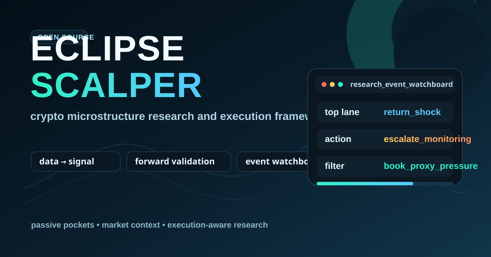

<div align="center">



<br/>


**A microstructure research and execution framework for Binance USDT-M futures.**
Built around invariant-protected state machines, passive fill simulation, and forward-validated alpha pockets.

[Architecture](#architecture) · [Research Pipeline](#research-pipeline) · [Quick Start](#quick-start) · [Project Structure](#project-structure) · [Disclaimer](#disclaimer)

</div>

---

## What Is This?

**Eclipse Scalper** is a research-driven scalping framework targeting Binance perpetual futures (ETHUSDT primary). It is not a simple script — it is an **invariant-protected execution engine** designed around:

- **Microstructure alpha research** — tick-level order flow imbalance, trade intensity, spread features, regime-conditioned signals
- **Passive fill simulation** — realistic limit-order fill modeling with depth proxy, touch rates, and adverse excursion accounting
- **Forward validation** — out-of-sample split testing with cost sensitivity sweeps before any pocket is promoted
- **Safety-first execution** — layered kill-switch → circuit breaker → risk manager → order router hierarchy; no bypass paths exist
- **Eventually-consistent state** — intent ledger + reconcile loop keep internal belief converged toward exchange truth across restarts

The repository contains the **core engine and research tools**. No exchange secrets, no live runtime state.

---

## Architecture

```
                  Telegram Control / Notifier
                           |
                           v
  config/ ──> execution/bootstrap.py ──> execution/guardian.py
                           |                      |
                           v                      v
              execution/entry_loop.py      risk/kill_switch.py
              execution/entry_decision.py  execution/circuit_breaker.py
                           |                      |
                           v                      |
              execution/order_router.py <─────────┘
              execution/order_verifier.py
                           |
                           v
                     exchanges/binance
                     paper runtime = dry-run guards + paper startup profile
                           |
                           v
              execution/reconcile.py
              execution/position_manager.py

  ── Persistence sidecar ──────────────────────────────────────
  brain/state.py · brain/persistence.py (LZ4)
  execution/intent_ledger_persistence.py · state/*.json

  ── Research pipeline ────────────────────────────────────────
  data/microstructure.db
    └─ tools/micro_edge_lib.py          (1-sec bucket features)
        └─ tools/micro_edge_signal_v2.py (signal generation)
            └─ tools/micro_edge_backtest.py
                └─ execution/passive_execution_simulator.py
                    └─ tools/validate_passive_pocket_forward.py
                        └─ tools/rank_passive_pockets_forward.py
                            └─ reports/*.md · reports/*.json
```

### Safety Hierarchy

Every entry travels down this chain. Higher layers always dominate. No layer may bypass the one above it. Protective exits (`reduce_only=True`) are **exempt** — they always route through regardless of gate state.

```
Kill-switch
  ↓ dominates
Circuit breaker
  ↓ dominates
Risk manager (sizing / notional caps)
  ↓ dominates
Entry gate (20+ checks)
  ↓ dominates
Order router → Exchange adapter
```

---

## Research Pipeline

The microstructure pipeline is a **deterministic, lookahead-free** computation system fully isolated from live execution.

### Feature Set (1-second buckets)

| Feature | Formula |
|---|---|
| `imbalance` | `(buy_qty - sell_qty) / (buy_qty + sell_qty)` |
| `trade_intensity` | `trade_count × 60` (annualized to per-minute rate) |
| `spread` | `|VWAP - mark_price| / mark_price` |
| `mid` | `(best_bid + best_ask) / 2` (via mark proxy) |

### Top Alpha Pocket (ETH, h=120s)

```
abs(imbalance) >= 0.5   AND
trade_intensity >= 3500  AND
spread <= 0.0003
```

| Side | Touch Rate | Fill Rate | Hit Rate | Adverse Path |
|---|---|---|---|---|
| SELL | 76.6% | 39.7% | 55.5% | 10.21 bps |
| BUY  | 78.9% | 38.3% | 56.4% | 10.15 bps |

### Regime Conditioning (UP/DOWN, rolling 1h log-return)

| Strategy | h=120s, fee ≤ 0.5 bps | Verdict |
|---|---|---|
| SELL + UP regime | pass=55.6%, NPA=7.09e-05 | **GO** |
| BUY + UP regime  | pass=50.0%, NPA=5.28e-05 | **GO** |
| SELL + DOWN regime | all negative NPA | NO-GO |
| BUY + DOWN regime  | marginal at fee=0 only | MARGINAL |

Break-even maker fee: ~0.8 bps/leg for UP-regime strategies.

### Passive Fill Model

```python
# SHORT: limit placed above entry price (fills on up-move)
limit_SHORT = ep * (1 + 0.5 * spread)

# LONG: limit placed below entry price (fills on down-move)
limit_LONG  = ep * (1 - 0.5 * spread)

# Depth proxy (0..1, 1 = full fill likely)
depth = (px - limit) / (ep * spread)   # SHORT
depth = (limit - px) / (ep * spread)   # LONG
full_proxy = touched AND depth >= 0.5
```

---

## Quick Start

### Prerequisites

- Python 3.13
- Binance API key (futures-enabled) or paper mode (no key needed)
- SQLite microstructure database (`data/microstructure.db`) — populated by the tick collector

```bash
pip install -r requirements.txt
```

### Paper Trading

```bash
# Review .env.paper and keep SCALPER_ENV_PROFILE=paper / SCALPER_DRY_RUN=1
# Prefer no private Binance keys for paper mode unless sandbox-only.

powershell -NoProfile -ExecutionPolicy Bypass -File .\scripts\start_paper_trading.ps1
# or
python -m execution.bootstrap
```

### Run the Research Pipeline

```bash
# Forward-validate a candidate pocket
python -m tools.validate_passive_pocket_forward \
  --symbol ETHUSDT --rule micro_edge_v3_passive_alpha \
  --horizon 120 --maker-fee-bps 0.5

# Rank pockets from a filter sweep report
python -m tools.rank_passive_pockets_forward \
  --candidates-md reports/FILTER_SWEEP_V3_21D_ETH_h120_ADV1p2.md \
  --regime up
```

### Launch Dashboard

```bash
# Backend
python dashboard/backend.py

# Frontend (separate terminal)
cd dashboard/frontend && npm run dev
```

---

## Project Structure

```
eclipse_scalper/
├── bot/                    # Core runner and async orchestration loop
├── execution/              # Entry, exit, order routing, reconcile, guardian
│   ├── bootstrap.py        # Service startup, state restore, reconcile init
│   ├── order_router.py     # Intent → exchange submission (single path)
│   ├── reconcile.py        # Exchange truth correction loop
│   ├── entry_loop.py       # 20+ gate checks before any intent is created
│   └── passive_execution_simulator.py  # Fill model for research
├── strategies/             # Signal logic (Eclipse Scalper strategy)
├── risk/                   # Kill-switch, circuit breaker, risk manager
├── exchanges/              # Binance adapter + paper trading adapter
├── brain/                  # Persistent state (LZ4), performance memory
├── tools/                  # Microstructure research CLI tools
│   ├── micro_edge_lib.py   # Feature computation
│   ├── micro_edge_backtest.py          # Execution-aware backtest
│   ├── validate_passive_pocket_forward.py
│   └── rank_passive_pockets_forward.py
├── dashboard/              # FastAPI backend + React/Vite frontend
├── data/                   # microstructure.db (SQLite, tick data)
├── reports/                # Research outputs (markdown + JSON)
├── docs/                   # Architecture, invariants, runbooks
├── notifications/          # Telegram control + alerts
├── config/                 # Static configuration helpers
└── tests/                  # Pytest suite
```

---

## Tech Stack

| Layer | Technology |
|---|---|
| Core language | Python 3.13, asyncio |
| Exchange connectivity | `python-binance`, `ccxt` / `ccxtpro` |
| Data storage | SQLite (`data/microstructure.db`) |
| Numerics | NumPy, Pandas, SciPy, scikit-learn |
| Brain persistence | LZ4 binary via `lz4` |
| Dashboard backend | FastAPI, aiohttp |
| Dashboard frontend | React, Vite, TypeScript |
| Notifications | `python-telegram-bot` |
| Testing | pytest |

---

## Key Design Invariants

| ID | Contract |
|---|---|
| EXE-01 | One intent → at most one live exchange order (idempotency via stable `intent_id`) |
| EXE-02 | Every intent reaches a terminal state on every code branch (no ledger limbo) |
| EXE-03 | Kill-switch blocks all entries; reduce-only exits always pass |
| DAT-01 | No lookahead bias — signals at `t` use only data with index ≤ `t` |
| DAT-03 | Research tools are deterministic — same inputs + same seed = identical outputs |
| SAF-01 | No secrets are logged, printed, or persisted in any form |
| SAF-02 | Paper/dry-run mode never submits live orders to the exchange |

Full invariant specification: [`docs/INVARIANTS.md`](docs/INVARIANTS.md)

---

## Escalation Path

```
Simulation (backtest) → Paper trading → Micro capital → Live
```

The system is designed for **gradual escalation**. Never skip stages.

---

## Disclaimer

> **This is experimental research software. It can lose money.**
>
> - No guarantee of profitability is made or implied.
> - The system will behave exactly as configured — verify your configuration.
> - Use **dry-run / paper mode** first. Use **micro capital** next.
>   Only then consider real exposure — and only capital you can afford to lose entirely.
>
> You are solely responsible for every trade executed.

---

<div align="center">

Built with obsessive attention to execution safety and research determinism.
**Eclipse Scalper / CryptoLion** — microstructure research for perpetual futures.

</div>
