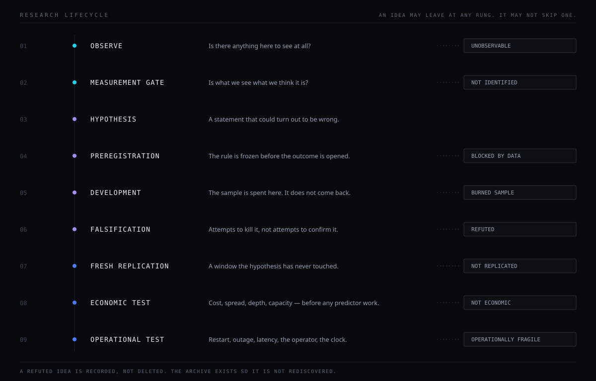
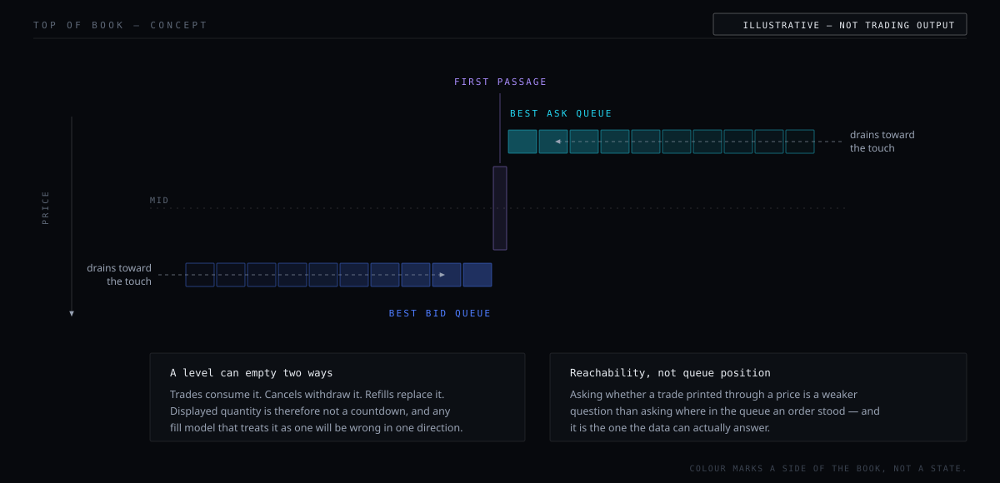

<div align="center">


<br/>

[](https://github.com/phoenixsenses/eclipse_scalper/actions/workflows/ci-tests.yml)
[](https://github.com/phoenixsenses/eclipse_scalper/actions/workflows/ops-smoke.yml)


**A mechanism-first market microstructure research and execution framework for perpetual futures.**

[Why](#why-eclipse-exists) · [What it is](#what-eclipse-is) · [Method](#research-philosophy) · [Architecture](#system-architecture) · [Safety](#execution-safety) · [Quick start](#quick-start) · [Docs](#documentation) · [What it does not claim](#what-eclipse-deliberately-does-not-claim)

</div>

---

## Why Eclipse exists

Four statements that are easy to agree with and expensive to actually build around:

- **A backtest can be profitable for the wrong reason.** Search a wide enough space and
  the best configuration looks excellent by construction.
- **A correlation is not a mechanism.** Something that moves with the market is not
  thereby something the market does.
- **A signal is not a trade.** Direction can be real and still sit under the cost of
  acting on it.
- **A million events are not a million experiments.** Overlapping windows, correlated
  symbols and shared outcomes collapse an impressive `N` into a small number of
  independent units.

Eclipse exists to keep five things apart that are routinely collapsed into one:

```
information  ·  mechanism  ·  economic value  ·  execution feasibility  ·  operational value
```

Most of what this repository does is establish that something is **not** yet the next one
along that line. That is the intended output. A system that only tells you when it
succeeded cannot tell you which of its successes are real.

---

## What Eclipse is

A **research system with an execution layer**, not a strategy with a research folder
attached.

| It is | It is not |
|---|---|
| a market-microstructure observatory | a signal service |
| a deterministic research framework with frozen contracts | a notebook with a good result in it |
| an execution and risk engine with a stated dominance order | a wrapper around an exchange SDK |
| forward and fresh-epoch validation infrastructure | a backtest with an out-of-sample slice |
| a governance layer deciding what may be *claimed* | a place where a passing test becomes a fact |

Concretely, in this repository: 59 execution modules, 141 test modules, four CI workflows
including three required chaos scenarios and a reliability gate that is tested in both
directions, and a documentation set written to be read from outside.

**The default state of this system is observing.** Acting is the exception, and it has to
be asked for.

> ### Public framework, private research estate
>
> Eclipse is split across two repositories, on purpose.
>
> **This one is the engineering framework**: the execution and risk engine, its safety
> contracts, its tests, its CI gates, and the method that governs what may be claimed.
>
> **The research estate is private**: the measurement lanes, the frozen rule
> specifications, the preregistrations, the outcome ledgers and the governance
> subsystem.
>
> A framework whose whole purpose is to keep information, mechanism, economic value,
> execution feasibility and operational value apart can be shown in full. The specific
> rules it has tested, and what they returned, cannot be. You can read every safety
> contract here, run the whole published suite offline, and reproduce every CI gate —
> what you cannot do is reconstruct a strategy, which is the intended outcome rather
> than a gap.
>
> How this repository is assembled, and what is deliberately absent:
> [`docs/public/PUBLIC_REPOSITORY_PROVENANCE.md`](docs/public/PUBLIC_REPOSITORY_PROVENANCE.md).

---

## Research philosophy



### The ladder

Every question is asked in this order. The order is not stylistic — skipping a rung is
how a measurement artefact becomes a market story.

```
MARKET QUESTION
   → OBSERVABILITY           can this be seen at all?
   → MEASUREMENT FIDELITY    is the record faithful to the event?
   → TARGET SEMANTICS        is the measured thing the asked-about thing?
   → STATISTICAL INFORMATION is there signal beyond noise?
   → MECHANISM               is there a reason, or only a correlation?
   → ECONOMICS               does it survive cost, spread, depth, capacity?
   → EXECUTION VALUE         does the fill model survive a real book?
   → OPERATIONAL VALUE       does it survive restarts, outages, latency, the operator?
```

A case from this project's own record: on one line, fidelity passed nearly perfectly —
the recorded events matched the real ones. The result was still weak, and the reason sat
one rung lower, at target semantics: the exchange's aggregated trade record compresses
several raw trades into a single row, so the object being measured was coarser than the
object being asked about. Two adjacent rungs, two entirely different stories about the
same weak number.

### Rules that are not negotiable

**`UNOBSERVED ≠ ZERO`** — seeing no record in a window does not mean nothing happened
there. Absence becomes evidence only after observability is demonstrated *for that
window*. If an empty-data guard drops a day, that is an event: it gets logged and the
shortfall in `N` gets audited.

**Coverage is checked at the point of use.** A feed can be healthy in aggregate and dead
exactly where a statistic reads. Global health has lied here before.

**Individual feed health ≠ joint observability.** Any multi-feed study publishes joint
second-level coverage, internal gaps and usable event counts **before any result is
read**. Two feeds can each be almost perfectly healthy and overlap far less than that.

**Know a gate's null value before freezing it.** A continuity condition was once frozen
as a gate here and everything failed it — and the gate was wrong, not the data, because
the exchange's own id allocation leaves small gaps. A gate whose behaviour under normal
conditions is unknown cannot separate a defect from normality. Its twin: test any
incremental-fit statistic on **pure noise** first.

**A large event count is not a large amount of evidence.** The independent unit is a
connected component of overlapping outcome windows — not a row, and not a greedily
selected event. Support-disjoint does not imply independent, so serial dependence is
measured and the effective count reduced. Cross-sectional work is pooled into one test
with a sign test across symbols; looking symbol by symbol and keeping the best is the
multiplicity error with extra steps.

**Multiplicity is corrected over the whole programme.** This has a sharp consequence,
accepted here rather than argued around: a result can be the best in a programme's
history — clean permutation `p`, clean walk-forward — and still not be significant once
the number of independent ideas the programme actually tried is counted.

**Development spends the sample.** A window used to develop a rule cannot later validate
it, however the analysis is re-framed. Material change to a frozen object makes a **new
version with a fresh forward count at zero**, not an amended old one.

**Economics before predictors.** Compute the value available to a hypothetical *perfect*
forecaster first. If that ceiling sits under the cost of trading, the route closes and no
model quality reopens it. A directionally-supported, out-of-sample-valid signal was
closed here on exactly that basis. Being right about the sign is not the same as having a
trade.

**Falsification, not confirmation.** A test is designed to kill a hypothesis. A test
designed to confirm one succeeds on noise often enough to be worthless.

Full treatment: [`docs/public/RESEARCH_METHOD.md`](docs/public/RESEARCH_METHOD.md).

---

## Research state machine

An idea moves through states, and **three** of them are terminal answers, not two.

```
QUESTION → IDENTIFIABILITY → CONTRACT FROZEN → DEVELOPMENT → ROBUSTNESS
         → FRESH REPLICATION → ECONOMIC TEST → OPERATIONAL TEST
```

| Terminal state | Meaning |
|---|---|
| `REFUTED` | a test killed it. Archived with the condition that closed it, and not re-run |
| `RETAINED` | it survived this rung. Not a promotion, and not an edge |
| `NOT IDENTIFIED` | the question as posed cannot be answered by the data available |
| `BLOCKED BY DATA` | the estimand is fine; the observability is not |
| `OPERATIONALLY FRAGILE` | it works and it will not survive contact with an operator |

`NOT IDENTIFIED` is not a soft no. It says the study design, not the market, was the
binding constraint — and recording it as a weak refutation would lose exactly that
information. Relatedly: **power is not transferable between estimands.** A sample sized
for a mean test is not a sample sized for a tail test.

**Refuted ideas are archived, never deleted.** Without that, a research programme
rediscovers its own dead ends and calls each rediscovery a finding.

---

## System architecture


Six planes, one rule: **a plane may read the one above it; no plane may write to the one
above it.** The border that matters most sits between research and execution — research
reads execution's records and never reaches across to act.

Three planes of *state* exist inside execution and are never guaranteed to agree at any
instant: internal belief, exchange state, and the persisted intent ledger.
`execution/reconcile.py` is the designated convergence mechanism and the only component
permitted to assert truth about positions and fills. Code that assumes immediate
consistency between the three is a defect by definition.

Full map: [`docs/public/ARCHITECTURE_OVERVIEW.md`](docs/public/ARCHITECTURE_OVERVIEW.md)
· [`docs/ARCHITECTURE.md`](docs/ARCHITECTURE.md)

---

## Execution safety


An order is never submitted directly. Every action becomes an **intent** first — a
journaled declaration with a stable id and a lifecycle — and exactly one module turns
intents into exchange actions.

Contracts, as stated in [`docs/INVARIANTS.md`](docs/INVARIANTS.md):

| ID | Contract |
|---|---|
| `EXE-01` | one intent produces at most one live exchange order — idempotency on a stable intent id |
| `EXE-02` | every intent reaches a terminal state on every branch; no ledger limbo |
| `EXE-03` | kill switch and flatten dominate entry logic; reduce-only exits always pass |
| `EXE-04` | restart converges incomplete runtime state to a safe reconciled state |
| `EXE-05` | sizing and notional constraints are enforced before submission |
| `DAT-01` | no lookahead — a signal at `t` uses only data at index ≤ `t` |
| `DAT-02` | trade timing alignment: signal index < entry index < exit index |
| `DAT-03` | deterministic simulation, seeded per event |
| `DAT-04` | cost-unit correctness — the bps-to-ratio conversion is applied exactly once |
| `DAT-05` | debug JSONL schema stability, additive only |
| `VAL-01` | true forward splits, no overlap leakage from discovery |
| `VAL-02` | ranking reproducibility |
| `VAL-03` | candidate parsing integrity — no silent zero-candidate failures |
| `SAF-01` | secrets never logged, printed or persisted |
| `SAF-02` | paper mode cannot submit a live order |

**One exemption, and it is deliberate.** Protective exits (`reduce_only`) route
regardless of gate state. A stack that can block its own exit is not a safety stack.

**Restart is a normal event.** Bootstrap restores brain state and the intent ledger, then
runs reconcile *before* the position manager begins managing anything.

**Execution functions do not raise to their callers.** They catch internally, return a
safe sentinel and emit telemetry. One symbol's failure must not take down the loop
managing every other symbol's exit.

> Honest note on the invariant document: `docs/INVARIANTS.md` §5 still lists `EXE-01`,
> `EXE-02` and `SAF-02` as TODO test gaps. Those three test files now exist. The document
> understates its own coverage, and it also names three module paths that no longer
> resolve. Both are recorded in
> [`docs/maintenance/PUBLIC_SURFACE_AUDIT.md`](docs/maintenance/PUBLIC_SURFACE_AUDIT.md) §T-9 and
> §T-11 rather than quietly patched, because it is a contract document.

---

## Data and observability

Eclipse distinguishes, and keeps distinguishing, things that are easy to conflate:

| Distinction | Why it matters |
|---|---|
| exchange event time vs local observation time | one of them is about the market; the other is about your network |
| coverage vs join health | every feed can be healthy while their intersection is not |
| missingness vs absence | a gap in a record is not a quiet market |
| observable absence vs unobserved | only the first one is data |
| measurement uncertainty vs market uncertainty | different rungs, different remedies |

Nothing is backfilled into a window a statistic will read. A forward-filled value is an
invented observation, and inventing observations is how a coverage gap turns into a
result.

The operator dashboards are **not part of this repository**. Their aggregator reads
internal research artifacts, so a published version would mean deleting most of its
adapters and shipping an aggregator that imports nothing. Stating the boundary is more
honest than fabricating a shell — and it is worth knowing that, internally, neither
dashboard exposes an order, cancel or position-control endpoint.

---

## Validation

| Stage | What it is |
|---|---|
| Historical development | where the sample is spent. It does not come back |
| Robustness | permutation, walk-forward, seed sweeps, cost sensitivity |
| Fresh replication | a non-overlapping epoch the hypothesis has never touched |
| Forward observation | accumulating from zero, under a sealed contract |
| Economic test | cost, spread, depth, capacity — with an oracle ceiling computed first |
| Operational test | restart, outage, latency, concentration, the operator |

Supporting discipline: contracts frozen before the outcome is opened · thresholds chosen
in development and reported on the held-out window · day and episode dependence measured
rather than assumed · concentration audits · multiplicity corrected across the programme.

**Not every branch has passed all of these.** Most have stopped at one of the first
three. Presenting the ladder is not a claim to have climbed it.

---

## Reproducibility

- **Determinism is contractual**: same inputs and same seed produce identical outputs;
  seeds are echoed into report headers; event ids derive from input data, never from a
  fresh UUID or the wall clock.
- **Content-hashed manifests** inventory the governance corpus with byte counts and
  SHA-256 digests — rebuilt as the *last* action of a change, never mid-change.
- **Study fingerprints**: a study's identity covers every component of its specification.
  Change any component after an epoch begins and it is a new version and a new epoch. A
  silent amendment is not a discipline problem here; it is structurally impossible.
- **Append-only correction**: superseded statements are marked, not erased; prior
  canonical versions are retained; the errata ledger never edits the source it corrects.
- **Canonical identity** is study / lane / UUID, not a display number, and historical
  numbering is never rewritten to tidy it.

Details, including what reproducibility does *not* buy:
[`docs/public/REPRODUCIBILITY.md`](docs/public/REPRODUCIBILITY.md).

---

## Current research frontier

Concept level only. Outcomes under an open contract stay sealed until their evaluator
opens them, and none are published here — including, and especially, the ones that would
be most interesting to publish.

- **Level-1 queue state and price innovation** — what the top of the book can and cannot
  say about the next price, posed as a first-passage question rather than a prediction
  problem.
- **Measurement fidelity versus target semantics** — separating *the record is faithful*
  from *the record is about the right object*. A single accuracy number hides the
  difference, and the difference is usually the answer.
- **The endogenous market clock** — whether activity-driven variance belongs to a symbol
  or to a clock the whole market shares. Where it is shared, it is a risk-state feature
  and never an alpha.
- **Execution timing and cost realism** — what a fill model has to get right before an
  execution result means anything.
- **Decision-value identification** — whether a ranking metric identifies decision value
  *at all*. Strictly prior to asking whether one metric beats another, and repeatedly the
  binding constraint.

<details>
<summary><b>What the top of the book actually offers</b> — illustrative, no measured value</summary>

<br/>



Two things this figure makes concrete, both of which change what a fill model may assume:

**A level can empty two ways.** Trades consume it; cancels withdraw it; refills replace
it. Displayed quantity is therefore not a countdown, and a fill model that treats it as
one will be wrong in a predictable direction.

**Reachability is a weaker question than queue position — and it is the answerable one.**
Asking *did a trade print through this price* needs no model of queue dynamics. Asking
*where in the queue did my order sit* needs one, and the data does not support it.
Preferring the weaker question is not modesty; it is the difference between a result and
an artefact.

</details>

---

## Module map

Every path below exists in this repository and was checked.

| Path | Role |
|---|---|
| `execution/` | intent lifecycle, entry gates, order router, verifier, reconcile, position and protection management, belief controller, telemetry, preflight, deterministic passive simulator |
| `risk/` | `kill_switch.py` — the hard stop that dominates the stack |
| `exchanges/` | `base` · `binance` · `coinbase` · `mock` · `validator` |
| `strategies/` | strategy entry point and signal scaffolding |
| `brain/` | persistent state, LZ4 persistence, performance memory |
| `core/` | fee model, micro features, micro signal, regime, latency profiling |
| `bot/` | the async orchestration loop |
| `data/` | collectors, quality checks, feature registry and label plumbing |
| `tools/` | the operational modules CI invokes: reliability gate, telemetry chain, health and data-readiness checks |
| `notifications/`, `monitoring/` | alert spooling, notifier chain, status snapshots, Prometheus surface |
| `config/`, `utils/` | configuration helpers and shared utilities including logging redaction |
| `src/`, `ami/` | measurement plumbing and host-health primitives the engine depends on |
| `tests/` | 141 modules, including `tests/legacy_tools/` chaos and invariant suites |
| `docs/` | contracts, runbooks, and `docs/public/` — the documentation written to be read from outside |

**Not in this repository**, and why: the research and shadow tooling, the report corpus,
the governance subsystem, the frozen protocols, the operator dashboard, and the runtime
state. Each exclusion has a stated reason in
[`docs/maintenance/public_allowlist.json`](docs/maintenance/public_allowlist.json).

The dashboard is the one worth naming explicitly: its aggregator reads internal research
artifacts, so a published version would mean deleting most of its adapters and shipping
an aggregator that imports nothing. The boundary is stated rather than fabricated.

## Quick start

Everything in this section is offline and safe. Nothing here connects to an exchange,
places an order, or needs a credential.

### Install

```bash
git clone https://github.com/phoenixsenses/eclipse_scalper.git
cd eclipse_scalper
pip install -r requirements.txt
```

CI runs on Python 3.11 and 3.12.

### Run the tests

```bash
pytest -q
```

Large suite. Run a couple of files per invocation when working on a subsystem, and point
`--basetemp` at a writable scratch directory if your environment needs it.

### Verify the contracts yourself

Every command below runs offline against this repository:

```bash
# EXE-01 — one intent, at most one live exchange order
pytest -q tests/test_order_router_idempotency.py

# EXE-02 — every intent reaches a terminal state on every branch
pytest -q tests/test_order_router_intent_lifecycle.py

# SAF-02 — paper mode cannot place a live order
pytest -q tests/test_paper_mode_no_live_orders.py

# the three chaos scenarios CI requires
pytest -q tests/legacy_tools/test_execution_chaos_scenarios.py

# the execution invariant suites CI runs
pytest -q tests/legacy_tools/test_belief_controller_unit.py
pytest -q tests/legacy_tools/test_intent_ledger_unit.py
pytest -q tests/legacy_tools/test_replace_manager_unit.py
pytest -q tests/legacy_tools/test_reliability_gate_unit.py
```

> **Where the `DAT-*` and `VAL-*` tests are.** They exercise the research
> pipeline — feature alignment, deterministic simulation, cost units, forward
> splits — and they import the research tooling directly. That tooling is part of
> the private estate, so its tests live with it. The contracts are stated here
> and in [`docs/INVARIANTS.md`](docs/INVARIANTS.md); what this repository lets you
> *run* is the execution and safety family. Saying so is more useful than
> shipping tests that cannot execute.

### The publication checker

The documentation in this repository is machine-checked against the policy it
describes:

```bash
python docs/maintenance/tools/check_public_docs.py             # 0 = clean
python docs/maintenance/tools/check_public_docs.py --self-test  # inject violations, all must be caught
```

### Paper mode

Paper mode needs configuration review before it does anything, and it is deliberately not
a one-liner here. Read [`docs/ENV_REFERENCE.md`](docs/ENV_REFERENCE.md) and
[`docs/OPS_RUNBOOK.md`](docs/OPS_RUNBOOK.md) first. No `.env` file of any kind is tracked
in this repository, including the example — supply your own, and prefer no exchange keys
at all for paper work.

**Live execution is off by default and stays off unless an explicit launcher flag is
passed.** That is not an example in this README on purpose.

---

## Testing and CI

Four workflows in [`.github/workflows/`](.github/workflows):

| Workflow | Gates |
|---|---|
| [`ci-tests.yml`](.github/workflows/ci-tests.yml) | **three required chaos scenarios** · execution invariant suites · reliability gate · PR reliability comment · nightly full chaos |
| [`ops-smoke.yml`](.github/workflows/ops-smoke.yml) | offline bootstrap and ops-tool smoke |
| [`telemetry-dashboard.yml`](.github/workflows/telemetry-dashboard.yml) | scheduled telemetry snapshot with notifier smoke |
| [`telemetry-smoke.yml`](.github/workflows/telemetry-smoke.yml) | notifier smoke chain |

The three required chaos scenarios, by their names in the workflow matrix:

- `ack-after-fill-recovery` — the router recovers from a timeout and a duplicate, then
  reports a partial fill
- `cancel-unknown-idempotent` — cancelling an already-filled unknown order is an
  idempotent success
- `replace-race-single-exposure` — a contradictory reconcile snapshot escalates belief
  and clears a phantom

**The detail worth noticing:** the reliability gate is run **twice** in one job — once on
a clean fixture expecting a pass, and once on a fixture with missing journal coverage
expecting a **non-zero exit**. The second run is the one that matters. A rule that never
fires reads exactly like a rule that passes, and making it fire on purpose is the only
way to tell them apart.

The same principle governs this repository's publication checker
(`docs/maintenance/tools/check_public_docs.py`), which is mutation-tested against 28 deliberate
violations — a discipline adopted after a widened rule elsewhere was silently broken and
reported a clean surface for a while.

---

## Documentation

[**`docs/public/`**](docs/public/) is the documentation index — start there.

| You want | Go to |
|---|---|
| how Eclipse decides that something is true | [`docs/public/RESEARCH_METHOD.md`](docs/public/RESEARCH_METHOD.md) |
| the six planes, and which are in this repository | [`docs/public/ARCHITECTURE_OVERVIEW.md`](docs/public/ARCHITECTURE_OVERVIEW.md) |
| the hard contracts, with detection and enforcement per invariant | [`docs/INVARIANTS.md`](docs/INVARIANTS.md) |
| what this repository is, and what is deliberately absent | [`docs/public/PUBLIC_REPOSITORY_PROVENANCE.md`](docs/public/PUBLIC_REPOSITORY_PROVENANCE.md) |
| to run it | [`docs/OPS_RUNBOOK.md`](docs/OPS_RUNBOOK.md) · [`docs/ENV_REFERENCE.md`](docs/ENV_REFERENCE.md) |
| to contribute, or to report a vulnerability | [`CONTRIBUTING.md`](CONTRIBUTING.md) · [`SECURITY.md`](SECURITY.md) |

How the repository is assembled and checked lives in
[`docs/maintenance/`](docs/maintenance/) — the allowlist, the checkers, and the record of
what they caught. It is release engineering, not reading material.

---

## Status

State vocabulary, used identically here and on the public site:

`accepted` built **and** passed an independent review gate · `building` exists as code,
under construction · `design` specified, not built · `planned` neither · `research` an
open question · `refuted` closed by a test, kept on the record · `parked` not refuted,
blocked on something that does not exist yet

| Area | State |
|---|---|
| Research method and governance | `building` |
| Preregistration, contracts, hypothesis ledger | `building` |
| Execution safety stack | `building` |
| Chaos and reliability gates in CI | `building` |
| Forward and fresh-epoch observation | `building` |
| Operator dashboards | `building` |
| Public site and its policy checker | `accepted` |
| Cross-market portability | `research` |
| Live capital deployment | `planned` |

Kept current in [`docs/public/PROJECT_STATUS.md`](docs/public/PROJECT_STATUS.md).

`accepted` describes the review state of code. It says nothing about a running thing and
nothing about a market result. **No component here is claimed to be running, healthy or
profitable, and no colour on any Eclipse surface may say so.**

---

## Roadmap

Direction only. No dates, and no unpublished hypotheses.

| Theme | What has to be true |
|---|---|
| Measurement fidelity | joint coverage and target semantics settled before a result is read, every time, by construction rather than by discipline |
| Mechanism replication | a mechanism reproduced on an epoch that never informed it |
| Execution realism | a fill model whose assumptions have themselves been tested against the book |
| Risk governance | a governor that demonstrates value against a matched comparison, not against nothing |
| Cross-market portability | pooled cross-sectional tests rather than per-symbol selection |
| Operational validation | survival of restart, outage, latency and the operator, measured rather than assumed |

Public phase detail lives on the site's roadmap, which carries no dates by policy.

---

## What Eclipse deliberately does not claim

The section that should make this repository easier to trust, not harder.

- **No route is claimed to be validated.** Not one. Historical performance is not
  evidence about the future, and this project's own record contains results that looked
  clean and did not survive a multiplicity correction over the whole programme.
- **Statistical association does not establish a market mechanism.**
- **Displayed level-1 quantity does not reveal participant intent.** A level empties
  through cancellation as readily as through trading.
- **Backtest fills are not live execution.** A fill model is a hypothesis and is treated
  as one.
- **A development PASS is not a validated result**, and a passing verdict token is not a
  promotion.
- **A large `N` is not a large amount of independent evidence.**
- **A reproducible result can be reproducibly wrong.** Determinism protects the chain
  from the analyst, not the conclusion from the market.
- **The fee basis is not uniform across all historical code paths.** It is tracked as an
  open contradiction, which means numbers computed under different bases are not
  cross-comparable — and this repository says so rather than normalising it away.
- **No licence has been granted.** There is no `LICENSE` file. A previous version of this
  README carried an MIT badge with no licence behind it; the badge has been removed and
  the licence question is an open owner decision. Until one is added, default copyright
  applies.
- **Experimental research software can lose money.**

---

## Disclaimer

> **This is experimental research software. It can lose money.**
>
> No guarantee of profitability is made or implied, and no route in this repository is
> claimed to be validated. The system behaves exactly as configured — verify your
> configuration. Use dry-run and paper mode first, micro capital next, and only then
> consider real exposure, with capital you can afford to lose entirely.
>
> Nothing here is investment advice. You are solely responsible for every trade executed.

---

<div align="center">

<sub>**SΞNSE · ECLIPSE** — OBSERVE · MEASURE · FALSIFY · REPLICATE · EXECUTE</sub>

</div>
