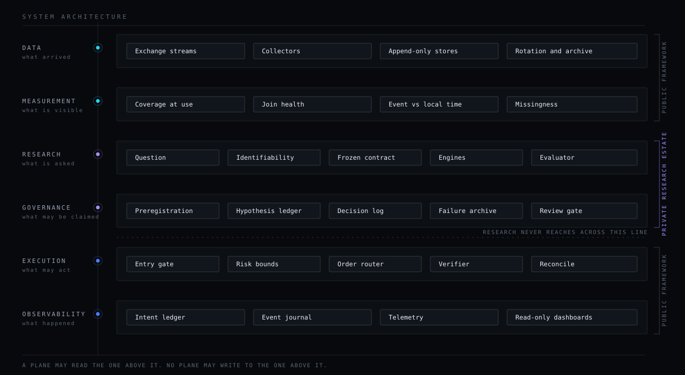
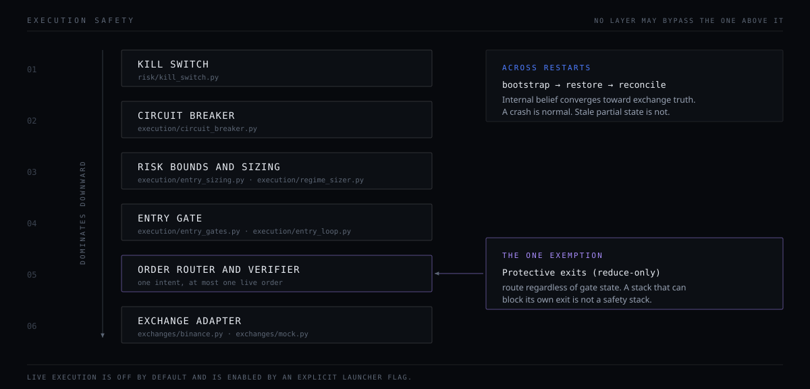

# ARCHITECTURE OVERVIEW

A map of Eclipse's architecture, and of which parts of it live in this repository.

Eclipse is split deliberately: **this repository is the engineering framework; the
research estate is private.** The six planes below describe the whole system, because the
separation between them *is* the architecture and is worth seeing whole. Each plane says
whether its code is here. Every path named as present was checked to resolve.



---

## The six planes

Eclipse separates concerns into planes with a one-way relationship: **a plane may read
the one above it; no plane may write to the one above it.** The line that matters most
sits between research and execution — research reads execution's records and never
reaches across to act.

| Plane | Owns | In this repository? |
|---|---|---|
| Data | what arrived | **yes** — collectors, quality checks, feature and label plumbing |
| Measurement | what is visible | partly — the plumbing (readers, schemas) is here; the measurement lanes are not |
| Research | what is asked | **no** — engines, sweeps and evaluators are the private estate |
| Governance | what may be claimed | **no** — the epistemic subsystem, its registries and ledgers |
| Execution | what may act | **yes** — `execution/`, `risk/`, `exchanges/`, `strategies/`, `core/`, `bot/` |
| Observability | what happened | partly — intent ledger, event journal and telemetry are here; the operator dashboards are not |

The one-way rule holds across all six: **a plane may read the one above it; no plane may
write to the one above it.** The border that matters most is between research and
execution — research reads execution's records and never reaches across to act. That
border is also, not coincidentally, where this repository ends.

---

## Execution plane

The execution plane is built around one idea: **an order is never submitted directly.**
Every action becomes an *intent* first — a journaled declaration with a stable id and a
lifecycle — and exactly one module turns intents into exchange actions.

```
config → bootstrap → guardian / preflight
                        │
                        ├── entry_loop → entry_gates → entry_signals → entry_sizing
                        │                     │
                        │                     ▼
                        │              intent_ledger
                        │                     │
                        │                     ▼
                        │       order_router → order_verifier → order_validation
                        │                     │
                        │                     ▼
                        │              exchanges/binance · exchanges/mock
                        │                     │
                        └── reconcile ◄───────┘
                                 │
                                 ▼
                         position_manager · protection_manager
```

Three planes of state exist and are **never guaranteed to agree at any instant**:
internal belief (`brain/state.py`), exchange state, and the persisted intent ledger.
`execution/reconcile.py` is the designated convergence mechanism and the only component
permitted to assert truth about positions and fills. Any code that assumes immediate
consistency between the three is a defect by definition.

### Safety ordering



| Layer | Where |
|---|---|
| Kill switch | `risk/kill_switch.py` |
| Circuit breaker | `execution/circuit_breaker.py` |
| Risk bounds and sizing | `execution/entry_sizing.py`, `execution/regime_sizer.py` |
| Entry gate | `execution/entry_gates.py`, `execution/entry_loop.py` |
| Order router and verifier | `execution/order_router.py`, `execution/order_verifier.py` |
| Exchange adapter | `exchanges/binance.py`, `exchanges/mock.py` |

Higher layers dominate lower ones. A lower layer may not re-check a higher layer's
condition in order to skip it — it relies on the higher layer having already enforced it,
which is why the ordering is a contract rather than a convention.

**One exemption, and it is deliberate.** Protective exits (`reduce_only`) route
regardless of gate state. A stack that can block its own exit is not a safety stack; it
is a way to end up with uncontrolled open exposure and no way to close it.

### Restart is a normal event

Bootstrap restores brain state and the intent ledger, then runs reconcile **before** the
position manager begins managing anything. A crash is expected; stale partial state is
the thing being defended against.

### Guardian-safe functions

Execution functions do not raise to their callers. They catch internally, return a safe
sentinel, and emit telemetry. One symbol's failure must not take down the loop that is
managing every other symbol's exit.

---

## Research and governance planes — not here

The research plane is a separate deterministic computation system with no live execution
side effects: it reads stores, it does not act. The governance plane above it decides what
may be *claimed*, as distinct from what may be *computed* — question and experiment
registries, hypothesis state, a failure archive, frozen contracts, decision records.

**Neither is part of this repository**, because both are made of the thing that cannot be
published: the rules under test, and what they returned.

What *is* here is the part of that boundary the engine touches — a deterministic, seeded
passive fill simulator, the simulation harnesses under `execution/sim/`, and the read-only
measurement plumbing under `src/microphys/`.

The method those planes run under is public even though their code is not. That is the
publishable part, and it is written out in [`RESEARCH_METHOD.md`](RESEARCH_METHOD.md) and
[`REPRODUCIBILITY.md`](REPRODUCIBILITY.md).

---

## Observability plane

| Surface | Nature |
|---|---|
| Intent ledger | durable, journaled intent lifecycle |
| Event journal | causal audit trail |
| Telemetry (JSONL) | machine-readable reliability record, additive schema only |
| Operator dashboards | **not in this repository** — see below |

**Why the dashboards are absent.** Their aggregator imports every adapter, and most of
those adapters read internal research artifacts. A published version would mean deleting
them and shipping an aggregator that imports nothing — placeholder functionality created
to make a check pass. The boundary is stated instead.

**On control paths, for completeness:** internally, neither dashboard exposes an order,
cancel or position-control endpoint, and the canonical operator surface is strictly
GET/HEAD over a read-only database.

JSONL evolution is additive-only. Fields may be added; renaming or removing one breaks
every analyzer downstream and is treated as a schema break.

---

## Testing and CI

`tests/` holds 159 modules here, including the chaos and invariant suites under
`tests/legacy_tools/`. The tests that exercise the research pipeline live with it: a test
is published only when everything it imports is, so a test for a private module stays
private whatever its fixtures look like.

Four workflows run in `.github/workflows/`:

| Workflow | What it gates |
|---|---|
| `ci-tests.yml` | frontend typecheck and tests · dashboard backend smoke · **three required chaos scenarios** · execution invariant suites · reliability gate · nightly full chaos suites |
| `ops-smoke.yml` | offline bootstrap and ops-tool smoke |
| `telemetry-dashboard.yml` | scheduled telemetry snapshot with notifier smoke |
| `telemetry-smoke.yml` | notifier smoke chain |

The three required chaos scenarios are named in the workflow matrix:

- `ack-after-fill-recovery` — the router recovers from a timeout and a duplicate, then
  reports a partial fill
- `cancel-unknown-idempotent` — cancelling an already-filled, unknown order is an
  idempotent success
- `replace-race-single-exposure` — a contradictory reconcile snapshot escalates belief
  and clears a phantom

The reliability gate is run **twice** in the same job: once on a clean fixture, expecting
a pass, and once on a fixture with missing journal coverage, expecting a **non-zero
exit**. That second run is the one that matters. A rule that never fires reads exactly
like a rule that passes, and the only way to tell them apart is to make it fire on
purpose.

---

## Running surfaces

`start_eclipse.ps1` / `status_eclipse.ps1` / `stop_eclipse.ps1` manage roles. **Live
execution is off by default** and requires an explicit `-EnableLive` flag; several other
roles are likewise opt-in switches rather than defaults. There is no boot auto-start.

The relevant public point is the shape, not the flags: the default state of this system
is *observing*, and acting is the exception that has to be asked for.
