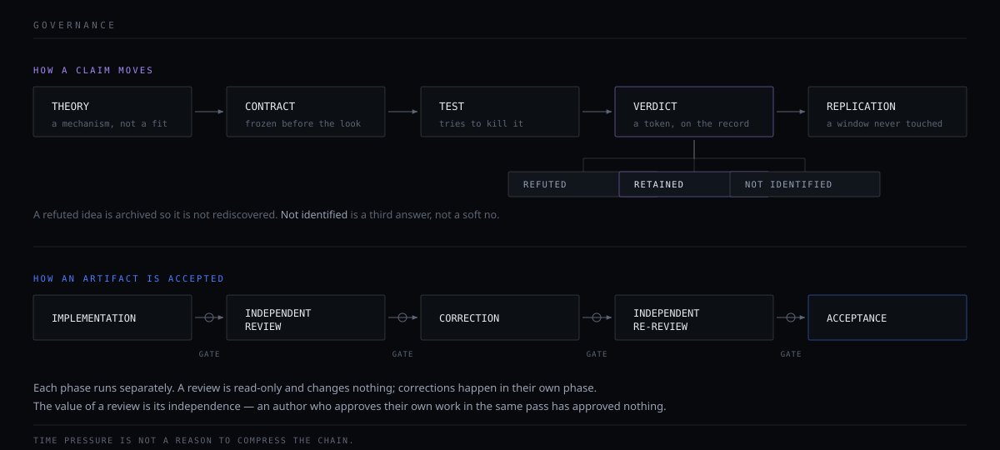

# RESEARCH METHOD

How Eclipse decides that something is true. Concept level only — this document contains
no threshold, no formula, no measured value and no result. That is deliberate: the method
is the publishable part.

---

## 1. The ladder

Every question is asked in this order. The order is not a style preference; skipping a
rung is how a measurement artefact gets mistaken for a market result.

```
MARKET QUESTION
   → OBSERVABILITY          can this be seen at all?
   → MEASUREMENT FIDELITY   is the record of the event faithful to the event?
   → TARGET SEMANTICS       is the thing being measured the thing being asked about?
   → STATISTICAL INFORMATION is there signal beyond noise?
   → MECHANISM              is there a reason, or only a correlation?
   → ECONOMICS              does it survive cost, spread, depth and capacity?
   → EXECUTION VALUE        does it survive the fill model meeting a real book?
   → OPERATIONAL VALUE      does it survive restarts, outages, latency and the operator?
```

A concrete case from Eclipse's own record, with the numbers removed: on one research
line the *fidelity* rung passed almost perfectly — the recorded events matched the real
events. The line still produced a weak result, and the reason was one rung lower down,
at **target semantics**: the exchange's aggregated trade record compresses several raw
trades into one row, so the object being measured was coarser than the object being
asked about. Fidelity and semantics are different rungs. Reading them as one rung would
have produced the wrong story about why the result was weak.

## 2. Unobserved is not zero

Seeing no record in a window does not mean nothing happened there.

This is the most expensive mistake available in market-microstructure research, because
absence looks like data. Eclipse's rule: **absence becomes evidence only after
observability has been demonstrated for that window.** If an empty-data guard drops a
day or a window, that is an event — it is logged, and why `N` is short gets audited. It
is never passed over quietly.

The corollary is uncomfortable and is enforced anyway: a feed can be healthy in
aggregate and dead exactly where a statistic reads. Coverage is therefore checked **at
the point of use**, not once globally at the top of a study.

## 3. Individual feed health is not joint observability

Any study reading more than one feed publishes, **before any result is read**:

- each feed's span and second-level coverage
- the number and fraction of seconds covered by **all** feeds jointly
- internal gaps
- days classified zero / partial / thin
- the number of usable events that survives

"Full" means joint coverage against the intended calendar — not "the small feed fits
inside the big one". Two feeds can each be 99% healthy and overlap far less than that.

## 4. Know a gate's null value before freezing it

Before a threshold or a pass/fail gate is frozen, its **expected value under noise or
under healthy data** is measured.

Eclipse has a case on the record where a continuity condition was frozen as a gate and
every candidate failed it — and the gate was wrong, not the data: the exchange's own id
allocation leaves small gaps, so the null value of that condition was never zero. A gate
whose null is unknown cannot distinguish a defect from normality.

Its twin: **test any incremental-fit statistic on pure noise first.** A statistic that
rewards added complexity will reward it on noise too, and you will not notice unless you
look.

## 5. A large event count is not a large amount of evidence

Events overlap. Outcome windows overlap. Symbols move together. The unit of independent
support is not the row.

Eclipse's practice:

- the independent unit is a **connected component of overlapping outcome windows**, not
  a greedily-selected event — a greedy count overstates the supply
- support-disjoint does not imply independent; serial dependence between components is
  measured, and the effective count is reduced accordingly
- cross-sectional work is pooled into a single test with a sign test across symbols;
  looking symbol by symbol and keeping the best one is the multiplicity error with extra
  steps
- the multiplicity correction is applied to the **whole programme**, not to the family
  a paper happens to report

That last point has a sharp consequence Eclipse accepted rather than argued around: a
result can be the best in a programme's history — clean permutation p, clean walk-forward
— and **still not be significant** once the number of independent ideas the programme
actually tried is counted. The corrected number is what counts.

## 6. Development spends the sample

A window used to develop a rule is spent. It does not come back, and a rule cannot be
validated on it later, however the analysis is re-framed.

Consequences carried in practice:

- a rule is **frozen in a preregistration before the outcome is opened**
- an arm is never measured on a window that contains its own definition
- when a frozen object changes materially, it becomes a **new version with a fresh
  forward count starting at zero** — not an amended old one
- validation runs on a window the hypothesis has never touched

## 7. Falsification, not confirmation

A test is designed to kill a hypothesis. A test designed to confirm one will succeed on
noise often enough to be useless.

Where a finding matters, it is checked from more than one angle at once — correctness,
does-it-reproduce, and whether it is really an artefact of the measurement — because
redundancy catches a failure mode diversity does not, and the reverse.

## 8. Economics before predictors

Before any predictor is built, an **oracle ceiling** is computed: the value available to
a hypothetical perfect forecaster of the quantity in question.

If that ceiling is below the cost of trading it, the route is closed, and no amount of
model quality reopens it. Eclipse closed a directionally-supported, out-of-sample-valid
signal this way — the direction was real and the ceiling was still far under the fee.
Being right about the sign is not the same as having a trade.

## 9. Three verdicts, not two

A test can end in `REFUTED`, `RETAINED` or `NOT IDENTIFIED`.

`NOT IDENTIFIED` is not a soft no. It says the question, as posed, cannot be answered by
the data available — the estimand is not identified, the supply of independent units is
insufficient, or the decision object the result would inform does not exist. It is
recorded as its own outcome, because treating it as a weak refutation loses the
information that the study design, not the market, was the binding constraint.

Related and equally load-bearing: **power is not transferable between estimands.** A
sample sized for a mean test is not a sample sized for a tail test.

## 10. Refuted ideas are archived, not deleted

Closed ideas go to a failure archive with the condition that closed them, and the
protocol forbids re-testing them. Without that, a research programme rediscovers its own
dead ends and calls each rediscovery a new result.

Publishing what a project refuses to re-run is a stronger signal than publishing what
passed.

## 11. Independence of review



Every artifact that needs verification moves through:

```
implementation → independent review → correction → independent re-review → acceptance
```

The phases run **separately**, with a human gate between them. A review is read-only and
changes nothing; corrections happen in their own phase. The reason is narrow and
absolute: the value of a review is its independence. An author who produces and approves
an artifact in one pass has approved nothing.

Time pressure is not a reason to compress the chain.

## 12. Nothing silently redefines the record

When a canonical statement changes:

- the previous version is retained under a history directory
- the version is incremented
- a dated changelog entry and a decision-log entry are added
- superseded statements are **marked as superseded rather than erased**

An errata ledger is append-only; a correction never edits the source it corrects. This is
the difference between a research record and a marketing page: the record keeps the
things it got wrong.

---

## What this method costs

Honest accounting, because a method described only by its virtues is a sales pitch:

- It is **slow**. Most rungs end in a stop.
- It **closes more than it opens**. That is the intended behaviour, and it does not feel
  like progress.
- It regularly proves that a question **cannot** be answered with the data on hand —
  which is a real result and an unsatisfying one.
- It makes an impressive-looking number harder to publish than a null one.

The alternative is a system that produces confident results and cannot tell you which of
them are real.
